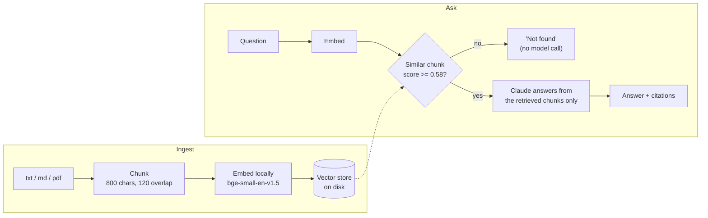

# RAG Knowledge Assistant

Ask questions about your own documents and get **cited answers**, or an honest "I couldn't find that" when the documents don't say.

A retrieval-augmented generation (RAG) service in Python: documents are chunked and embedded locally, the most relevant chunks are found by cosine similarity, and
Claude answers using **only** those chunks. Built to be small enough to read end to end, with the reasoning behind every design decision written down.



## Highlights

- **Grounded, cited answers.** Numbered context passages, `[n]` citations, and each response returns the source file, chunk number, similarity score and text.
- **Refuses instead of hallucinating.** A similarity threshold, calibrated from measured scores, stops off-topic questions *before* the model is called (cheaper and safer).
- **Retrieval is measured.** `python -m eval.run_eval` reports hit@4, MRR and refusal accuracy with no LLM cost. Current: **12/12 hit@4, MRR 0.958, 5/5 refused.**
- **Runs with no GPU and no key.** Local ONNX embeddings; an offline extractive fallback when no `ANTHROPIC_API_KEY` is set.
- **Swappable parts.** `Embedder` and `LLM` interfaces with dependency injection, so the tests run in about half a second using fakes (39 tests).
- **Production habits.** Typed error mapping (429/500/502/503), upload validation, env-based config, health endpoint, non-root Docker image.

## Quick start

```bash
python -m venv .venv
.venv\Scripts\activate            # Windows  (Mac/Linux: source .venv/bin/activate)
pip install -r requirements-dev.txt
pytest -q                          # 39 passed

# Index the sample documents and ask questions (works with no API key)
python -m app.cli ingest data/sample_docs
python -m app.cli ask "What is the hotel cap in London?"
python -m app.cli ask "How do I bake sourdough bread?"      # refused, no model call

# Use Claude for generated answers
copy .env.example .env             # then put your ANTHROPIC_API_KEY in .env
python -m app.cli ask "Can I use my personal ChatGPT account for client work?"

# Run the API, then open http://localhost:8000/docs
uvicorn app.api:app --port 8000
```

The first run downloads the embedding model (a quantised ONNX build, about 65 MB). It is cached in your system temp folder by default; set `FASTEMBED_CACHE_PATH` to keep it somewhere permanent.

**Requirements:** Python 3.10 or newer (the code uses `X | None` type syntax). Tested on Python 3.13 and 3.14 on Windows.

## Running in VS Code

1. **File > Open Folder** and choose the project folder.
2. Open a terminal (**Terminal > New Terminal**), then create and activate the environment and install the dependencies (see Quick start).
3. Press **Ctrl+Shift+P**, run **Python: Select Interpreter**, and choose the one inside `.venv`. *(Most "module not found" errors come from VS Code using a different Python.)*
4. Open **Run and Debug** (Ctrl+Shift+D). The project ships ready-made launch configurations: **API (uvicorn, reload)**, **CLI: ingest sample docs**, **CLI: ask a question**, **Retrieval eval**. Pick one and press **F5**.
5. Open the **Testing** panel (beaker icon) to run the 39 tests with a click (pytest is pre-configured in `.vscode/settings.json`).

## Troubleshooting

| Symptom | Cause and fix |
|---|---|
| `.venv\Scripts\activate` says *running scripts is disabled on this system* (PowerShell) | Run `Set-ExecutionPolicy -Scope Process -ExecutionPolicy Bypass`, then `.venv\Scripts\Activate.ps1`. Or use a Command Prompt terminal instead of PowerShell. |
| `ModuleNotFoundError: No module named 'app'` | The file was run from the wrong place. Run it as a module from the project root (`python -m app.cli ...`), or use the Run and Debug configurations. (The CLI and eval scripts also work from the Run button in the latest version: `git pull`.) |
| `ModuleNotFoundError: No module named 'fastapi'` (or `uvicorn`, `fastembed`, `anthropic`) | Dependencies are not installed in the interpreter VS Code is using. Select the `.venv` interpreter (step 3) and run `pip install -r requirements-dev.txt`. |
| `error: No Claude credentials found. Set ANTHROPIC_API_KEY.` (or the API returns HTTP 500 *"Server has no Claude credentials configured"*) | `LLM_PROVIDER=claude` was set without a key. Put `ANTHROPIC_API_KEY=...` in `.env`, or run offline with `LLM_PROVIDER=extractive`. |
| First command is slow or prints download progress | It is downloading the 65 MB embedding model once. |
| Warning about `huggingface_hub` symlinks on Windows | Harmless. Silence it with `HF_HUB_DISABLE_SYMLINKS_WARNING=1`. |
| `Address already in use` / port 8000 busy | Use another port: `uvicorn app.api:app --port 8001`. |
| `docker` is not recognised | Docker Desktop is not installed. Docker is optional; you do not need it to run the project. |
| Setting the key in PowerShell | `$env:ANTHROPIC_API_KEY = "sk-ant-..."` (Command Prompt: `set ANTHROPIC_API_KEY=sk-ant-...`). Or put it in `.env`. |

## API

| Method | Path | Purpose |
|---|---|---|
| `GET` | `/health` | Liveness check (does not load the model) |
| `GET` | `/documents` | Indexed files and their chunk counts |
| `POST` | `/documents` | Upload a `.txt` / `.md` / `.pdf` (max 5 MB). Re-uploading a file replaces it |
| `POST` | `/ask` | `{"question": "..."}` returns `{answer, grounded, citations[]}` |

```bash
curl -X POST localhost:8000/documents -F "file=@handbook.pdf"
curl -X POST localhost:8000/ask -H "Content-Type: application/json" \
     -d '{"question": "How many days of annual leave do I get?"}'
```

Example response (illustrative):

```json
{
  "answer": "Full-time employees receive 25 days of paid annual leave per year [1].",
  "grounded": true,
  "citations": [{"source": "leave-policy.md", "chunk_index": 0, "score": 0.83, "text": "..."}]
}
```

## Deploying to Vercel

The repo includes `pyproject.toml` with the entrypoint Vercel needs, so it deploys with no extra configuration:

```toml
[tool.vercel]
entrypoint = "app.api:app"
```

1. Import the GitHub repo in Vercel (or run `vercel` from the project folder).
2. In **Project Settings > Environment Variables** add `ANTHROPIC_API_KEY`. Without it the app still works, using the offline extractive answers.
3. Deploy, then open `https://<your-project>.vercel.app/docs`.

**How it adapts to Vercel.** A function's disk is read-only except `/tmp`, and instances are stateless. When Vercel sets the `VERCEL` variable the app therefore writes its index and model cache under `/tmp` and, because every new instance starts empty, indexes the bundled sample documents on start-up.

**What to expect (be aware of these):**
- **The first request after a cold start takes roughly 15 seconds** (it downloads the 65 MB embedding model and indexes the sample documents). Later requests on a warm instance take well under a second. Measured locally with the Vercel settings; not measured on Vercel itself.
- **Uploaded documents are not durable.** They live in `/tmp` on one instance and disappear when it is recycled, and other instances never see them. This is a demo deployment. For real use, keep the index in external storage (a hosted vector database such as Postgres with pgvector, or a blob store) instead of local files.
- **Not yet verified on Vercel:** this configuration was tested by simulating Vercel's environment locally; the deployment itself has not been run.

## Configuration

All settings are environment variables (see `.env.example`).

| Variable | Default | Meaning |
|---|---|---|
| `ANTHROPIC_API_KEY` | (none) | Enables Claude answers |
| `LLM_PROVIDER` | `auto` | `auto`, `claude` or `extractive` |
| `LLM_MODEL` | `claude-opus-5` | Any Claude model ID, e.g. a cheaper one |
| `EMBEDDING_MODEL` | `BAAI/bge-small-en-v1.5` | Local embedding model (changing it needs a re-index and re-calibration) |
| `CHUNK_SIZE` / `CHUNK_OVERLAP` | `800` / `120` | Characters per chunk / overlap |
| `TOP_K` | `4` | Chunks sent to the model |
| `MIN_SCORE` | `0.58` | Similarity below which the system says "not found" |
| `INDEX_DIR` | `storage/index` (`/tmp/rag-index` on Vercel) | Where the index is saved |
| `FASTEMBED_CACHE_PATH` | fastembed default (`/tmp/fastembed` on Vercel) | Where the embedding model is cached |
| `SEED_DIR` | empty (bundled samples on Vercel) | Folder indexed automatically when the index is empty |

## Project layout

```
app/
  config.py        settings from environment variables
  loader.py        txt / md / pdf -> text
  chunker.py       text -> overlapping chunks
  embeddings.py    text -> unit vectors (interface + fastembed)
  vector_store.py  cosine search + persistence (NumPy)
  llm.py           grounded prompt + Claude call + offline fallback
  rag.py           the pipeline: ingest and ask
  api.py           FastAPI service
  cli.py           command line
data/sample_docs/  three synthetic policy documents (a fictional company)
eval/              retrieval eval set and runner
tests/             39 tests (fakes, no network)
docs/              architecture, line-by-line walkthrough, study guide
scripts/           generator for the walkthrough (fails if any line is undocumented)
.vscode/          debug/launch configurations and pytest settings
pyproject.toml     dependencies + Vercel entrypoint
Dockerfile
```

## Documentation

- [**docs/ARCHITECTURE.md**](docs/ARCHITECTURE.md): system design, ingestion and query flows, data model, design decisions and trade-offs, threshold calibration, failure modes, security, scaling, limitations.
- [**docs/CODE_WALKTHROUGH.md**](docs/CODE_WALKTHROUGH.md): every line of the application code with its real line number, explained.
- [**docs/STUDY_GUIDE.md**](docs/STUDY_GUIDE.md): pitch, concepts, interview Q&A, demo script, exercises.

## Testing and evaluation

```bash
pytest -q                     # unit and API tests: fake embedder + fake LLM, no network or key needed
python -m eval.run_eval       # retrieval quality with the real embedding model, no LLM cost
python scripts/build_walkthrough.py   # regenerate docs/CODE_WALKTHROUGH.md (fails on undocumented lines)
```

## Docker

```bash
docker build -t rag-knowledge-assistant .
docker run -p 8000:8000 -e ANTHROPIC_API_KEY=... -v rag-data:/data rag-knowledge-assistant
```

> The Dockerfile follows standard patterns (dependency layer caching, model baked into the image, non-root user, health check), but the image has **not been build-tested** yet.

## Known limitations

Concurrent uploads are not locked; ingest is not atomic; scanned PDFs are not supported (no OCR); no hybrid search or re-ranking; no conversation memory; no authentication;
the eval set is small and synthetic; generation faithfulness is not yet measured automatically. Full list with fixes in [ARCHITECTURE.md, section 12](docs/ARCHITECTURE.md#12-limitations-and-roadmap).

The sample documents are synthetic. "Northwind Consulting" is fictional.
