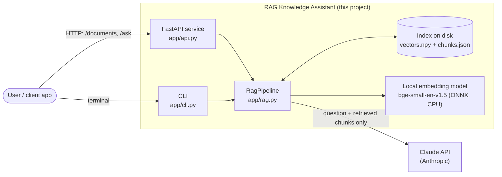
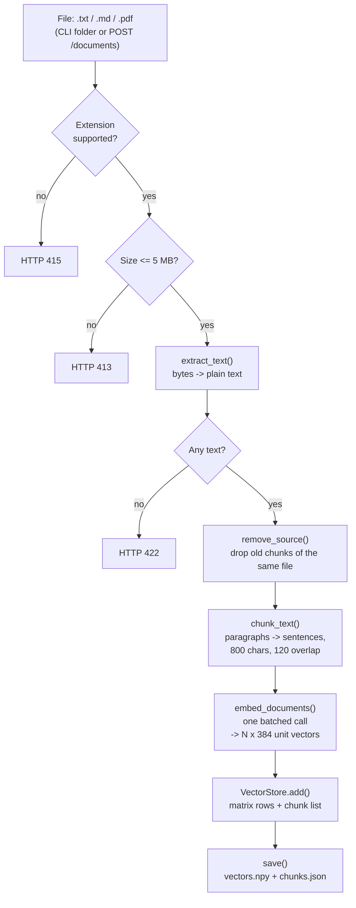
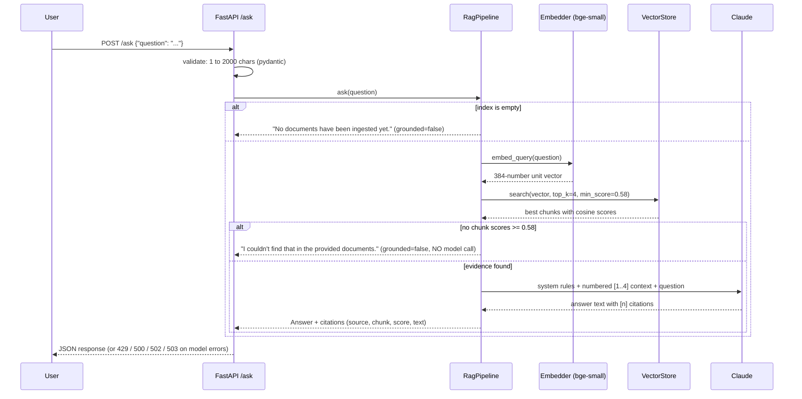
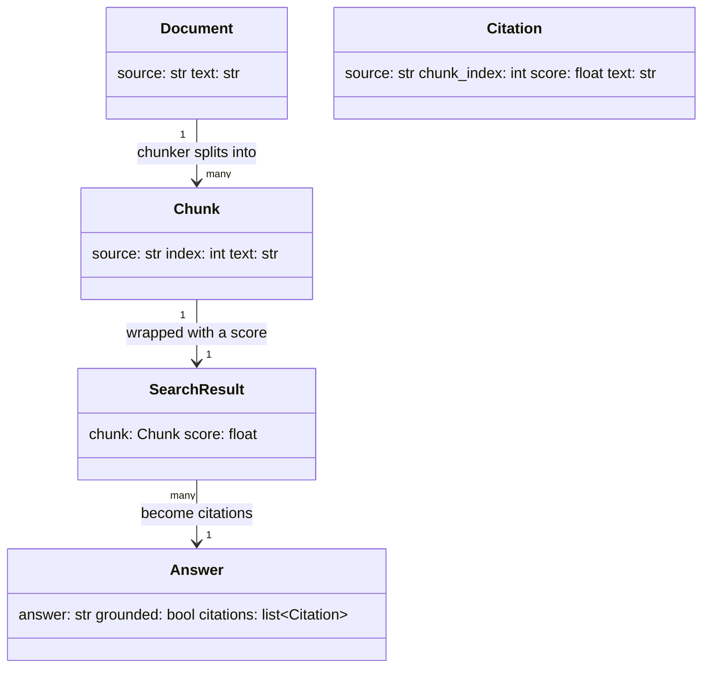
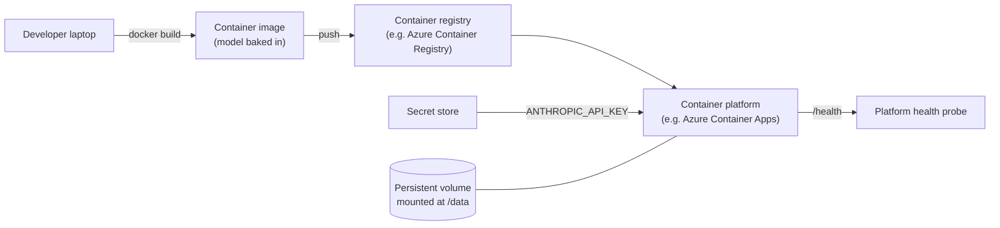

# System Design and Architecture

This document explains **what the system is, how data flows through it, why each decision was made, and where it breaks**.
For line-by-line detail see [CODE_WALKTHROUGH.md](CODE_WALKTHROUGH.md); for interview preparation see [STUDY_GUIDE.md](STUDY_GUIDE.md).

---

## 1. What problem does this solve?

A language model only knows what it was trained on. It has never seen your company handbook, contracts or tickets, and if you ask about them
it will either say it does not know or, worse, **make something up**.

**Retrieval-Augmented Generation (RAG)** fixes this without retraining the model:

1. **Retrieve**: find the few passages from *your* documents that are relevant to the question.
2. **Augment**: put those passages into the prompt.
3. **Generate**: ask the model to answer *using only those passages* and to cite them.

The answer is therefore grounded in your data, verifiable through citations, and up to date the moment you re-upload a file.

### Goals
- Answer questions from uploaded `.txt`, `.md`, `.pdf` files with **citations**.
- **Refuse** questions the documents cannot answer, instead of hallucinating.
- Run **locally with no GPU**; the only external call is to Claude for generation, and even that is optional (offline fallback).
- Be **small enough to understand completely**, and structured so parts are swappable (embedder, LLM, vector store).

### Non-goals (deliberately left out)
Authentication, multi-tenancy, OCR for scanned PDFs, hybrid keyword search, re-ranking, streaming responses, a web UI. These are listed in [section 12](#12-limitations-and-roadmap) with how each would be added.

---

## 2. System context



Two important boundaries:

- **Embedding happens locally.** Your full documents are never sent anywhere to be embedded.
- **Only the retrieved chunks and the question go to Claude**, never the whole corpus. This limits both cost and data exposure.

---

## 3. Components

| Component | File | Responsibility | Swappable with |
|---|---|---|---|
| Config | `app/config.py` | All settings from environment variables | pydantic-settings, a secrets manager |
| Loader | `app/loader.py` | Bytes to plain text for txt / md / pdf | Unstructured, Azure Document Intelligence (adds OCR) |
| Chunker | `app/chunker.py` | Split text into overlapping chunks | Token-based, semantic or structure-aware splitting |
| Embedder | `app/embeddings.py` | Text to unit-length vectors (interface + BGE implementation) | Azure OpenAI, Voyage, sentence-transformers |
| Vector store | `app/vector_store.py` | Store vectors, cosine top-k search, persistence | FAISS, pgvector, Azure AI Search, Qdrant |
| LLM | `app/llm.py` | Grounded prompt + Claude call (+ offline fallback) | Any model behind the same `generate()` interface |
| Pipeline | `app/rag.py` | Orchestrates ingest and ask; the decision logic | (this is the core; keep) |
| API | `app/api.py` | HTTP validation and error mapping | gRPC, a queue worker |
| CLI | `app/cli.py` | Terminal front end | n/a |

The pipeline talks to **interfaces** (`Embedder`, `LLM`) and receives them through its constructor
(*dependency injection*). That is what makes every part replaceable and every test fast.

---

## 4. Flow A: Ingestion (getting documents in)



| Step | What happens | Code | Why |
|---|---|---|---|
| Validate | Check extension and size, reject early | `api.py` `upload_document` | Cheap checks first; protects memory |
| Extract | Bytes to text | `loader.extract_text` | One function serves disk and HTTP |
| Replace | Delete previous chunks of the same file name | `VectorStore.remove_source` | Re-upload updates, never duplicates |
| Chunk | Split into overlapping pieces | `chunker.chunk_text` | Small focused chunks retrieve precisely |
| Embed | One batch call for all chunks of the file | `FastEmbedEmbedder.embed_documents` | Batching is much faster than one at a time |
| Store | Append to matrix and chunk list | `VectorStore.add` | Row *i* of the matrix is chunk *i* |
| Persist | Write to disk | `VectorStore.save` | Restarts do not lose the index |

### Why chunk at all?
An embedding is one vector per piece of text. A 30-page document embedded as one vector is a blurry average of everything in it;
a question about one specific clause would match it weakly. Chunks of about 800 characters (a few paragraphs) each have a **sharp** meaning.
Overlap (120 characters) means a fact cut by a chunk boundary still appears whole in one of the two chunks.

---

## 5. Flow B: Query (answering a question)



### The three decision points in `RagPipeline.ask`
1. **Empty index**: nothing to search; say so; no model call.
2. **Nothing similar enough** (`min_score`): return "not found" **without calling the model**. This is the main hallucination defence:
   the model never gets the chance to invent an answer to an off-topic question. It also saves cost and latency.
3. **Evidence found**: call Claude with only the retrieved chunks, with rules to use only that context and cite `[n]`.

### What retrieval actually computes
Every chunk and the question are 384-number vectors of length 1. Their **dot product equals their cosine similarity**:
1.0 = same direction (same meaning), around 0 = unrelated. Searching is one matrix multiplication:

```
scores = chunk_matrix (N x 384)  @  question_vector (384,)   ->   (N,) similarity scores
```

then sort, take the best `top_k`, and drop anything under `min_score`.

---

## 6. Data model



**On disk** (`INDEX_DIR`, default `storage/index/`):

| File | Content | Format |
|---|---|---|
| `vectors.npy` | N x 384 float32 matrix, one row per chunk | NumPy binary |
| `chunks.json` | List of `{source, index, text}`, same order as the matrix rows | JSON |

**Invariant:** row *i* of the matrix is the vector of `chunks[i]`. Every method of `VectorStore` preserves it.

---

## 7. Key design decisions

| # | Decision | Alternatives considered | Why this choice | Trade-off accepted |
|---|---|---|---|---|
| 1 | **Local embeddings** (`bge-small-en-v1.5` via fastembed / ONNX) | Hosted embedding API; sentence-transformers (needs PyTorch) | No extra API key, no data leaves the machine for embedding, CPU-only, small download, strong quality for size. Claude has no embeddings endpoint. | English-focused; less accurate than the biggest models; model download on first run |
| 2 | **Own NumPy vector store**, brute-force cosine | Chroma, FAISS, pgvector, Azure AI Search | Transparent (you can explain every line), zero dependencies, exact results, trivial to test | O(N) per query and the whole index in RAM; fine to tens of thousands of chunks, not millions |
| 3 | **Unit-length vectors + dot product** | Compute cosine explicitly each time | Search becomes a single fast matrix multiply | Must remember to normalise everything |
| 4 | **Similarity threshold** (`MIN_SCORE`) before calling the LLM | Always call the LLM and rely on the prompt to refuse | Cheaper, faster, and removes hallucination risk for off-topic input | A fixed threshold can wrongly refuse a valid but oddly-phrased question; needs calibration (see section 8) |
| 5 | **Strict grounding prompt** with numbered context and `[n]` citations | Free-form prompt | Verifiable answers; exact refusal sentence | Reduces but does not eliminate hallucination; the model can still mis-cite |
| 6 | **Interfaces + dependency injection** (`Embedder`, `LLM`) | Hard-wire the concrete classes | Swappable parts; tests use fakes (33 tests in about half a second, no network) | A little more structure than a script |
| 7 | **Offline extractive fallback** LLM | Fail if no API key | The whole project runs and demos with no key or cost; CI is free | Fallback answers are raw passages, not synthesised |
| 8 | **Lazy Claude client** | Create the client at import time | App starts, serves `/health`, accepts uploads even without a key | Missing key is discovered at first question |
| 9 | **Sync endpoints** (`def`, not `async def`) | Async endpoints | Embedding is CPU-bound and the SDK call is blocking; FastAPI runs sync endpoints in a thread pool so the event loop is never blocked | One thread per in-flight request |
| 10 | **Replace-on-reingest** keyed by file name | Append only; content hashing | Editing and re-uploading a file just works | Two files with the same name collide |
| 11 | **Typed error mapping** for Claude errors (429 / 500 / 502 / 503) | Let exceptions become generic 500s | Clients can distinguish "retry later" from "server misconfigured" | More code |
| 12 | **Retrieval evaluated separately from generation** (`eval/run_eval.py`) | Only eyeball final answers | Retrieval failures are the most common RAG failure; it is free to measure (no LLM calls) | The eval set is small and synthetic |

---

## 8. Calibrating the "I don't know" threshold

Retrieval **always returns the nearest chunks**, even for nonsense. So a cut-off is needed. Rather than guess, it was measured on the sample corpus:

| Question | Top similarity score | Should be answered? |
|---|---|---|
| What is the capital of France? | 0.43 | No |
| How do I bake sourdough bread? | 0.43 | No |
| Who won the 2022 World Cup? | 0.36 | No |
| What is the CEO's salary? | 0.50 | No |
| What is the company's stock price? | **0.52** (highest off-topic) | No |
| Hotel cap in London | 0.64 | Yes |
| Personal ChatGPT for work | 0.62 | Yes |
| How many days of annual leave? | 0.83 | Yes |

Off-topic tops out at 0.52; genuine matches start around 0.62 to 0.64 (for each of the eval's 12 real questions, the top-scoring chunk scored at least 0.64).
`MIN_SCORE = 0.58` sits in the gap. The first attempt (0.45) was **too low**: it would have sent the CEO-salary and stock-price questions to the model.

**Caveats you should be able to state:** the threshold is specific to this embedding model and this corpus, and the gap here is clean partly because the corpus is small.
On a large, varied corpus, off-topic questions will score higher and the gap narrows. Re-run `python -m eval.run_eval` after any change to the model, chunking or documents.

Current eval result: **hit@4 = 12/12, MRR = 0.958, 5/5 unanswerable questions correctly refused.**

---

## 9. Failure modes and how each is handled

| Failure | Where handled | Behaviour |
|---|---|---|
| Unsupported file type | `api.py` | HTTP 415 |
| File over 5 MB | `api.py` | HTTP 413 (read stops at limit + 1 byte; huge files never fully loaded) |
| Corrupt PDF / no extractable text | `api.py` | HTTP 422 |
| Empty or oversized question | pydantic | HTTP 422 |
| Empty index | `rag.py` | "No documents have been ingested yet."; no model call |
| Off-topic question | `rag.py` | "I couldn't find that..."; no model call |
| Model rate limit | `api.py` | HTTP 429 (client should retry) |
| Bad or missing API key | `api.py` | HTTP 500, generic message (no detail leaked) |
| Network failure to Claude | `api.py` | HTTP 503 |
| Other Claude error status | `api.py` | HTTP 502 |
| Model refuses (`stop_reason == "refusal"`) | `llm.py` | Safe message, no crash |
| Model says answer is not in context | Prompt rule 1 | Exact "not found" sentence |
| Restart | `VectorStore.load` | Index reloaded from disk; empty index if none |

---

## 10. Security and privacy

- **Secrets:** the API key comes from the environment (`.env` is git-ignored; `.env.example` is committed with no values).
- **Upload hardening:** extension whitelist, 5 MB cap, `Path(name).name` strips folder components from file names.
- **Data exposure:** the retrieved chunks and question are sent to Claude. Do not index data you are not allowed to send to that provider.
- **Prompt injection:** a document could contain text like "ignore your instructions". The prompt wraps documents in `<context>` tags and states the rules in the system prompt, which helps but **does not eliminate** the risk. Do not use this over untrusted documents for anything with side effects.
- **No authentication or authorisation.** Anyone who can reach the service can upload and query. Fine for a local demo; not for the internet. In production put it behind an identity layer (for example Microsoft Entra ID) and per-user or per-tenant indexes.
- **Container:** runs as a non-root user (see Dockerfile).

---

## 11. Performance, cost and scaling

**Cost per question.** One model call with roughly the question plus up to 4 chunks of about 200 tokens each plus the system prompt: on the order of 1,000 to 1,500 input tokens.
At the published Claude Opus 5 rate of $5 per million input and $25 per million output tokens, that is well under a cent per question (an estimate; check your own usage numbers).
Choose a cheaper model with `LLM_MODEL`. Questions the threshold refuses cost nothing.

**Where the time goes (qualitatively):** the model call dominates; embedding one question on CPU is fast; the matrix multiply is negligible at this scale; the first request is slow because the embedding model loads (cold start).

**Scaling path**

| Corpus size | What to change |
|---|---|
| Up to ~50k chunks | Nothing; brute force in RAM is fine |
| ~50k to a few million | Approximate nearest-neighbour index (FAISS / HNSW) or a vector DB (pgvector, Azure AI Search, Qdrant) |
| Many users | Move the index out of the process (shared store), add auth and per-tenant filtering, run several stateless API replicas |
| Heavy ingestion | Move ingest to a background queue/worker so uploads return immediately |
| Quality ceiling reached | Hybrid search (BM25 + vectors) and a cross-encoder re-ranker |

---

## 12. Limitations and roadmap

Honest list, in rough priority order:

1. **Concurrency:** ingest mutates the in-memory store with no lock; two simultaneous uploads could interleave. Add a lock or a single writer.
2. **Ingest is not atomic:** old chunks are removed before the new ones are embedded; a failure in between loses the old version. Embed first, then swap.
3. **Index files are not written atomically** (temp file + rename would fix it).
4. **No OCR:** scanned PDFs are rejected.
5. **Naive sentence splitting** (regex); "Dr. Smith" splits mid-name.
6. **File name is the identity:** same-named files collide.
7. **No hybrid search or re-ranking:** exact identifiers (part numbers, error codes) are weak spots for pure vector search.
8. **No streaming:** the client waits for the full answer.
9. **No conversation memory:** each question is independent; follow-ups like "and for New York?" will not work.
10. **Small synthetic eval set:** 12 answerable and 5 unanswerable questions. Enough to catch regressions, not enough to prove production quality. Generation quality (faithfulness of the answer to the citations) is not measured automatically.
11. **Live Claude call not exercised in the automated tests:** the request shape, text extraction and refusal handling are unit-tested with a stub client. Run one real question with a key to see it end to end.
12. **Docker build not verified** on the machine this was written on.

---

## 13. Deployment outline



The design is **cloud-native by construction**: configuration via environment variables, secrets injected by the platform, stateless process except for the mounted index volume,
a health endpoint, a non-root container, and logs to stdout. It has been written to be deployable this way; it has **not** been deployed by this repository.
