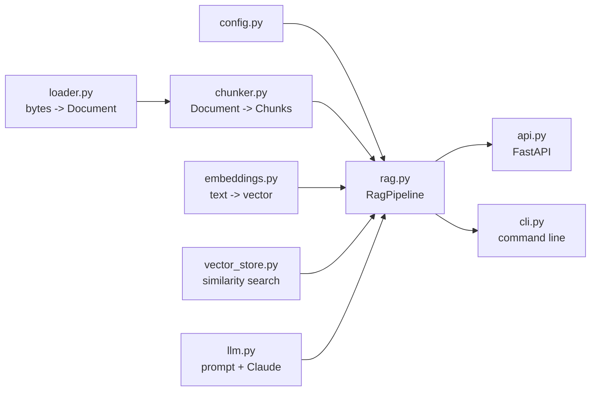

# Code Walkthrough: every line explained

> Generated by `scripts/build_walkthrough.py` from the real source files: the code shown here is exactly what is in the repository, with real line numbers. The script fails if any line is left unexplained.

**How to read this:** follow the files in the order below; it is the order data flows through the system. Read `docs/ARCHITECTURE.md` first if you want the big picture, then come here for the detail.

## The map



| Step | File | One-line job |
|---|---|---|
| 0 | `config.py` | All tunable settings from environment variables |
| 1 | `loader.py` | Read `.txt`/`.md`/`.pdf` into plain text |
| 2 | `chunker.py` | Split text into overlapping chunks |
| 3 | `embeddings.py` | Turn text into meaning-vectors |
| 4 | `vector_store.py` | Store vectors, find the nearest ones |
| 5 | `llm.py` | Build the grounded prompt, call Claude |
| 6 | `rag.py` | Orchestrate ingest and ask |
| 7 | `api.py`, `cli.py` | Expose it over HTTP and the command line |

Files are shown in that order, then the eval script, the tests and the Dockerfile.

---

## `app/config.py`

Central configuration. Every tunable number in the system lives here, read from environment
variables, so behaviour changes without code changes (the "12-factor app" rule: config in the environment).

**L1**

```python
1 | """Runtime configuration, read once from environment variables (12-factor style)."""
```

Module docstring. "12-factor style" means configuration comes from environment variables, never hard-coded, so the same container image runs in dev, test and production.

**L2-4**

```python
2 | import os
3 | from dataclasses import dataclass
4 | from pathlib import Path
```

Imports. `os` reads environment variables. `dataclass` gives us a tidy settings object. `Path` is the standard way to represent file-system paths (works on Windows and Linux).

**L6-8**

```python
6 | from dotenv import load_dotenv
7 | 
8 | load_dotenv()
```

`load_dotenv()` reads a local `.env` file (if one exists) into the process environment. It must run **before** the `Settings` class is defined, because the defaults below are evaluated once, when the class is created. In production (Docker/Azure) there is no `.env`; the platform injects real environment variables and this call quietly does nothing.

**L10-11**

```python
10 | ROOT = Path(__file__).resolve().parent.parent
11 | ON_VERCEL = bool(os.getenv("VERCEL"))  # Vercel functions have a read-only disk except /tmp
```

`ROOT` is the project folder (found relative to this file, so it works from any working directory). `ON_VERCEL` is true when the platform sets the `VERCEL` environment variable. **Why it matters:** a Vercel function's disk is **read-only except `/tmp`**, and `/tmp` is wiped whenever an instance is recycled, so paths that write (the index, the model cache) must move there.

**L14-15**

```python
14 | @dataclass(frozen=True)
15 | class Settings:
```

`@dataclass(frozen=True)` makes `Settings` an immutable record: once created, nobody can change a value by accident while the app runs. Tests create their own `Settings(...)` with overrides instead of touching globals.

**L16**

```python
16 |     index_dir: Path = Path(os.getenv("INDEX_DIR", "/tmp/rag-index" if ON_VERCEL else "storage/index"))
```

**Where the index is saved.** `os.getenv("INDEX_DIR", "storage/index")` means "use the env var if set, otherwise this default". On Vercel the default is `/tmp/rag-index`, because that is the only writable place there.

**L17**

```python
17 |     embedding_model: str = os.getenv("EMBEDDING_MODEL", "BAAI/bge-small-en-v1.5")
```

**Embedding model.** `bge-small-en-v1.5` produces 384-number vectors, runs on a plain CPU, and downloads as a small ONNX file. It is a strong quality-for-size choice. Changing it means re-indexing everything (vectors from different models are not comparable) and re-calibrating `MIN_SCORE`.

**L18**

```python
18 |     model_cache_dir: str | None = os.getenv("FASTEMBED_CACHE_PATH", "/tmp/fastembed" if ON_VERCEL else None)
```

**Where the embedding model is cached.** `None` means "fastembed's default" locally; on Vercel it is `/tmp/fastembed` (writable). The first request on a fresh instance downloads the model (about 65 MB) into it, which is why a cold start takes around 15 seconds.

**L19**

```python
19 |     seed_dir: str = os.getenv("SEED_DIR", str(ROOT / "data" / "sample_docs") if ON_VERCEL else "")
```

**Seed folder.** If set, and the index is empty at start-up, the documents in this folder are indexed automatically. Off locally (empty string); on Vercel it points at the bundled `data/sample_docs`, because an ephemeral instance always starts with an empty index and would otherwise have nothing to answer from.

**L20**

```python
20 |     llm_provider: str = os.getenv("LLM_PROVIDER", "auto")
```

**Which answer generator to use:** `auto` (Claude if an API key exists, else the offline extractive fallback), or force `claude` / `extractive`.

**L21**

```python
21 |     llm_model: str = os.getenv("LLM_MODEL", "claude-opus-5")
```

**Which Claude model.** Defaults to `claude-opus-5`. Set `LLM_MODEL=claude-sonnet-5` for a cheaper option; no code change needed.

**L22-23**

```python
22 |     chunk_size: int = int(os.getenv("CHUNK_SIZE", "800"))
23 |     chunk_overlap: int = int(os.getenv("CHUNK_OVERLAP", "120"))
```

**Chunking knobs.** `chunk_size` is in characters (800 is roughly 150 to 200 words, about 200 tokens). `chunk_overlap` (120, about 15%) repeats the end of one chunk at the start of the next, so a fact that straddles a boundary still appears whole in at least one chunk.

**L24**

```python
24 |     top_k: int = int(os.getenv("TOP_K", "4"))
```

**`top_k`: how many chunks are retrieved** and sent to the model. Too small: you miss the answer. Too large: you pay for noise and distract the model.

**L25**

```python
25 |     min_score: float = float(os.getenv("MIN_SCORE", "0.58"))
```

**`min_score`: the "I don't know" threshold.** Retrieval always returns the *closest* chunks even for nonsense questions, so we need a cut-off. It was calibrated on the sample data: off-topic questions scored up to 0.52, genuine matches scored 0.64 or more, so 0.58 sits in the gap. This number depends on the embedding model and the corpus; re-measure with `python -m eval.run_eval` if either changes.

**L26**

```python
26 |     max_answer_tokens: int = int(os.getenv("MAX_ANSWER_TOKENS", "4096"))
```

Maximum tokens Claude may produce. This budget also covers the model's internal reasoning on models that think by default, so it is set generously (4096) to avoid truncated answers.


---

## `app/loader.py`

Turns raw files into plain text. It is the only module that knows about file formats.

**L1**

```python
1 | """Turn files on disk (or uploaded bytes) into plain-text Document objects."""
```

Docstring: the loader's whole job is *files in, `Document` objects out*.

**L2-4**

```python
2 | import io
3 | from dataclasses import dataclass
4 | from pathlib import Path
```

`io` lets us wrap raw bytes so libraries can read them like a file. `dataclass` and `Path` as before.

**L6**

```python
6 | from pypdf import PdfReader
```

`pypdf` extracts text from PDF files (pure Python, no system dependencies).

**L8**

```python
8 | SUPPORTED_EXTENSIONS = {".txt", ".md", ".pdf"}
```

The set of supported extensions is defined **once** here and reused by both the CLI folder-walk and the API upload check, so they can never disagree.

**L11-14**

```python
11 | @dataclass(frozen=True)
12 | class Document:
13 |     source: str
14 |     text: str
```

`Document` is the unit of ingestion: `source` is the file name (used as the human-readable citation label *and* as the identity that lets re-uploading a file replace the old version), `text` is its content. `frozen=True` = immutable.

**L17**

```python
17 | def extract_text(filename: str, data: bytes) -> str:
```

`extract_text` takes the filename and the file's **bytes**, not a path. That one design choice lets the same function serve files on disk (CLI) and uploads over HTTP (API).

**L18**

```python
18 |     suffix = Path(filename).suffix.lower()
```

Look at the file extension in lower case, so `REPORT.PDF` works too.

**L19-21**

```python
19 |     if suffix == ".pdf":
20 |         reader = PdfReader(io.BytesIO(data))
21 |         return "\n\n".join(page.extract_text() or "" for page in reader.pages)
```

PDF branch. `io.BytesIO(data)` makes the bytes look like an open file. Each page's `extract_text()` can return `None` (for example scanned images with no text layer), hence `or ""`. Pages are joined with a blank line so the chunker later sees them as separate paragraphs. **Limitation:** scanned PDFs need OCR, which is not implemented.

**L22-23**

```python
22 |     if suffix in {".txt", ".md"}:
23 |         return data.decode("utf-8", errors="replace")
```

Text/Markdown branch: decode as UTF-8. `errors="replace"` swaps any bad byte for a placeholder character instead of crashing the whole ingest.

**L24**

```python
24 |     raise ValueError(f"Unsupported file type: {suffix or filename}")
```

Any other type raises `ValueError`. The API turns this into an HTTP 422 response.

**L27-28**

```python
27 | def load_bytes(filename: str, data: bytes) -> Document:
28 |     return Document(source=Path(filename).name, text=extract_text(filename, data))
```

`load_bytes` builds a `Document`. `Path(filename).name` keeps only the final file name and strips any folder parts: a **security** measure so an upload named `../../etc/passwd` cannot smuggle path components into the stored source name.

**L31-36**

```python
31 | def load_directory(directory: Path) -> list[Document]:
32 |     documents = []
33 |     for path in sorted(directory.rglob("*")):
34 |         if path.is_file() and path.suffix.lower() in SUPPORTED_EXTENSIONS:
35 |             documents.append(load_bytes(path.name, path.read_bytes()))
36 |     return documents
```

`load_directory` walks a folder for the CLI. `rglob("*")` is recursive; `sorted(...)` makes the order deterministic, so chunk numbering is reproducible between runs; the `if` keeps only real files with a supported extension; each is read and passed through `load_bytes`. **Limitation:** two files with the same name in different sub-folders would collide, because `source` is just the file name.


---

## `app/chunker.py`

Chunking: splitting a long document into pieces small enough to embed and retrieve precisely.
Why? A whole 30-page handbook has one blurry "average meaning" vector; small focused chunks have sharp ones.

**L1**

```python
1 | """Split documents into overlapping, size-bounded chunks that respect paragraph and sentence edges."""
```

Docstring: chunks are bounded in size, overlap slightly, and prefer to break at paragraph and sentence edges rather than mid-sentence.

**L2-5**

```python
2 | import re
3 | from dataclasses import dataclass
4 | 
5 | from app.loader import Document
```

`re` for regular expressions; `dataclass`; and `Document` from the loader, the input to chunking.

**L8-12**

```python
 8 | @dataclass(frozen=True)
 9 | class Chunk:
10 |     source: str
11 |     index: int
12 |     text: str
```

`Chunk` is what actually gets embedded and stored. `source` = which file; `index` = the chunk's position within that file (shown in citations, e.g. "expenses-policy.md, chunk 1"); `text` = the content.

**L15**

```python
15 | def _split_units(text: str, size: int) -> list[str]:
```

`_split_units` (leading underscore = internal helper) breaks text into **units**, each no longer than `size`. Units are the smallest pieces the packer below is allowed to work with.

**L16**

```python
16 |     units = []
```

Start with an empty list of units.

**L17**

```python
17 |     for paragraph in re.split(r"\n\s*\n", text):
```

`re.split(r"\n\s*\n", text)` splits on blank lines, i.e. into paragraphs.

**L18-20**

```python
18 |         paragraph = paragraph.strip()
19 |         if not paragraph:
20 |             continue
```

Trim whitespace; skip empty paragraphs (for example from several blank lines in a row).

**L21-23**

```python
21 |         if len(paragraph) <= size:
22 |             units.append(paragraph)
23 |             continue
```

If the whole paragraph fits, keep it intact: a paragraph is the most natural unit of meaning, so we avoid cutting it. `continue` jumps to the next paragraph.

**L24**

```python
24 |         for sentence in re.split(r"(?<=[.!?])\s+", paragraph):
```

The paragraph is too long, so split it into sentences. The pattern `(?<=[.!?])\s+` is a *lookbehind*: split on whitespace that comes right after `.`, `!` or `?`, keeping the punctuation with its sentence. **Limitation:** it is naive; "Dr. Smith" or "3.5" also trigger splits. A production system might use an NLP sentence splitter.

**L25-27**

```python
25 |             while len(sentence) > size:
26 |                 units.append(sentence[:size])
27 |                 sentence = sentence[size:]
```

If a single sentence is *still* longer than `size` (a huge table row, minified text), hard-cut it every `size` characters. This guarantees no unit ever exceeds the limit.

**L28-29**

```python
28 |             if sentence:
29 |                 units.append(sentence)
```

Keep whatever is left of the sentence after cutting (if anything).

**L30**

```python
30 |     return units
```

Return the list of units.

**L33**

```python
33 | def _overlap_tail(text: str, overlap: int) -> str:
```

`_overlap_tail` returns the last few characters of a finished chunk, to be repeated at the start of the next one.

**L34-35**

```python
34 |     if overlap <= 0:
35 |         return ""
```

If overlap is 0 (disabled) return an empty string.

**L36**

```python
36 |     tail = text[-overlap:]
```

Take the last `overlap` characters. `text[-120:]` is Python's negative slicing: "the final 120 characters".

**L37-38**

```python
37 |     first_space = tail.find(" ")
38 |     return tail[first_space + 1:] if first_space != -1 else tail
```

Find the first space and drop everything before it, so the overlap starts on a **whole word** instead of half a word like "ployees". If the tail has no space at all, keep it as is.

**L41**

```python
41 | def chunk_text(text: str, size: int = 800, overlap: int = 120) -> list[str]:
```

`chunk_text` is the main algorithm: pack units greedily into chunks of at most `size` characters. Defaults match the config defaults.

**L42-43**

```python
42 |     if overlap >= size:
43 |         raise ValueError("overlap must be smaller than size")
```

**Guard clause.** If overlap were as large as the chunk itself, each new chunk would be mostly a copy of the previous one and the algorithm would make no progress, so we reject that configuration up front.

**L44-45**

```python
44 |     chunks: list[str] = []
45 |     current = ""
```

`chunks` collects finished chunks; `current` is the chunk being built (a buffer).

**L46**

```python
46 |     for unit in _split_units(text, size):
```

Go through the units in order.

**L47**

```python
47 |         candidate = f"{current}\n\n{unit}" if current else unit
```

`candidate` is what `current` would look like if we appended this unit, separated by a blank line to preserve paragraph structure. If the buffer is empty, the candidate is just the unit.

**L48-50**

```python
48 |         if len(candidate) <= size:
49 |             current = candidate
50 |             continue
```

It still fits within `size`: accept it into the buffer and move on to the next unit.

**L51**

```python
51 |         chunks.append(current)
```

It does **not** fit, so the buffer is full: emit it as a finished chunk. (The buffer cannot be empty here: an empty buffer makes the candidate equal to a single unit, which is at most `size`, so we would have taken the branch above.)

**L52**

```python
52 |         tail = _overlap_tail(current, overlap)
```

Compute the overlap: the tail of the chunk we just finished.

**L53**

```python
53 |         joined = f"{tail}\n\n{unit}" if tail else unit
```

The next chunk starts with that tail followed by the unit that did not fit.

**L54**

```python
54 |         current = joined if len(joined) <= size else unit
```

Safety check: if tail plus unit would itself exceed `size`, drop the overlap for this chunk and start with just the unit. The size limit always wins.

**L55-56**

```python
55 |     if current:
56 |         chunks.append(current)
```

After the loop, flush the final partially filled buffer as the last chunk.

**L57**

```python
57 |     return chunks
```

Return all chunks as plain strings.

**L60-62**

```python
60 | def chunk_document(document: Document, size: int, overlap: int) -> list[Chunk]:
61 |     pieces = chunk_text(document.text, size, overlap)
62 |     return [Chunk(source=document.source, index=i, text=piece) for i, piece in enumerate(pieces)]
```

`chunk_document` wraps each string in a `Chunk` object carrying its source file and position (`enumerate` supplies 0, 1, 2, ...). This metadata is what makes citations possible later.


---

## `app/embeddings.py`

Embeddings: turning text into a list of numbers (a vector) such that texts with similar *meaning* get similar vectors.
This is what lets us search by meaning instead of by keyword.

**L1**

```python
1 | """Text to vectors. Everything downstream depends only on the Embedder interface."""
```

Docstring: the rest of the system only knows the `Embedder` interface, never the concrete library.

**L2**

```python
2 | from typing import Protocol
```

`Protocol` lets us declare an interface by shape ("anything with these methods") without inheritance.

**L4**

```python
4 | import numpy as np
```

NumPy: fast arrays and the maths for vectors.

**L7-10**

```python
 7 | class Embedder(Protocol):
 8 |     def embed_documents(self, texts: list[str]) -> np.ndarray: ...
 9 | 
10 |     def embed_query(self, text: str) -> np.ndarray: ...
```

The `Embedder` interface has **two** methods on purpose. `embed_documents` encodes many passages at once (batching is far faster than one at a time). `embed_query` encodes a single question. They are separate because *asymmetric* retrieval models such as BGE process queries differently from passages (a short question must be matched against long passages). Because it is a `Protocol`, the tests plug in a `FakeEmbedder`, and you could swap in Azure OpenAI or Voyage embeddings without touching the pipeline. The `...` bodies mean "no implementation here, this is only a contract".

**L13-15**

```python
13 | def unit_length(vectors: np.ndarray) -> np.ndarray:
14 |     norms = np.linalg.norm(vectors, axis=-1, keepdims=True)
15 |     return vectors / np.clip(norms, 1e-12, None)
```

`unit_length` scales every vector to length 1 (L2 normalisation). `np.linalg.norm(..., axis=-1, keepdims=True)` computes each vector's length; `np.clip(norms, 1e-12, None)` prevents division by zero; dividing gives length-1 vectors. **Why it matters:** for unit vectors, the plain dot product *equals* cosine similarity, so search later is one matrix multiplication, and scores land in a comparable range. `axis=-1` makes it work for one vector (query) or a batch (documents).

**L18**

```python
18 | class FastEmbedEmbedder:
```

The real embedder, backed by the `fastembed` library (ONNX runtime, CPU-only, no PyTorch needed).

**L19-22**

```python
19 |     def __init__(self, model_name: str, cache_dir: str | None = None):
20 |         from fastembed import TextEmbedding
21 | 
22 |         self._model = TextEmbedding(model_name=model_name, cache_dir=cache_dir)
```

Constructor. `cache_dir` (optional) says where the model files are stored; the pipeline passes `/tmp/fastembed` on Vercel because that is the only writable folder. The import sits **inside** the method (a *lazy import*), so importing this module, and running unit tests, does not load the heavy library or trigger a model download. `TextEmbedding(...)` downloads the model the first time (cached afterwards) and loads it into memory.

**L24-26**

```python
24 |     def embed_documents(self, texts: list[str]) -> np.ndarray:
25 |         vectors = np.array(list(self._model.embed(texts)), dtype=np.float32)
26 |         return unit_length(vectors)
```

`embed_documents`: `self._model.embed(texts)` returns a generator of arrays; `list(...)` runs it; `np.array(..., dtype=np.float32)` makes an `(n_texts, 384)` matrix in 32-bit floats (half the memory of the default 64-bit, precision is ample). Then normalise to unit length.

**L28-30**

```python
28 |     def embed_query(self, text: str) -> np.ndarray:
29 |         vector = np.array(next(iter(self._model.query_embed(text))), dtype=np.float32)
30 |         return unit_length(vector)
```

`embed_query`: `query_embed` applies the model's special *query instruction prefix* (BGE models are trained with one). It also returns a generator; `next(iter(...))` takes the single vector. The result has shape `(384,)`, normalised.


---

## `app/vector_store.py`

The vector store: holds every chunk's vector and answers "which chunks are most similar to this query vector?".
It is intentionally a small, readable, brute-force implementation (a NumPy matrix) so you can explain exactly what a vector database does.

**L1**

```python
1 | """A small in-memory vector store: brute-force cosine search, persisted to disk."""
```

Docstring. "Brute-force" means comparing the query against **every** stored vector: exact, simple, and fast enough for tens of thousands of chunks.

**L2-4**

```python
2 | import json
3 | from dataclasses import asdict, dataclass
4 | from pathlib import Path
```

`json` for saving chunk text; `asdict` converts a dataclass to a dictionary; `dataclass`; `Path`.

**L6-8**

```python
6 | import numpy as np
7 | 
8 | from app.chunker import Chunk
```

NumPy for the matrix maths, and `Chunk` from the chunker.

**L11-14**

```python
11 | @dataclass(frozen=True)
12 | class SearchResult:
13 |     chunk: Chunk
14 |     score: float
```

`SearchResult` pairs a chunk with its similarity `score` (cosine similarity, between -1 and 1; higher = more similar).

**L17-20**

```python
17 | class VectorStore:
18 |     def __init__(self) -> None:
19 |         self._vectors: np.ndarray | None = None
20 |         self._chunks: list[Chunk] = []
```

The store keeps two **parallel** structures: `_vectors`, an `(n_chunks, dim)` matrix (or `None` until the first add, because the vector dimension is not known in advance), and `_chunks`, a list of the matching chunk objects. **Invariant:** row `i` of the matrix is the vector for `_chunks[i]`. Every method must preserve this.

**L22-23**

```python
22 |     def __len__(self) -> int:
23 |         return len(self._chunks)
```

`__len__` makes `len(store)` work; the pipeline uses it to detect an empty index.

**L25-27**

```python
25 |     def add(self, chunks: list[Chunk], vectors: np.ndarray) -> None:
26 |         if len(chunks) != len(vectors):
27 |             raise ValueError("chunks and vectors must have the same length")
```

`add` first checks the invariant: same number of chunks and vectors.

**L28-29**

```python
28 |         if not chunks:
29 |             return
```

Nothing to add? Do nothing. This also protects the `vstack` below from an empty array.

**L30-31**

```python
30 |         self._vectors = vectors if self._vectors is None else np.vstack([self._vectors, vectors])
31 |         self._chunks.extend(chunks)
```

First add: the matrix *is* the given vectors. Later adds: `np.vstack` stacks the new rows below the old ones (this copies the array, O(n) per add: fine at this scale; a real vector DB uses an incremental index). Then extend the chunk list in the same order.

**L33-34**

```python
33 |     def remove_source(self, source: str) -> None:
34 |         keep = [i for i, chunk in enumerate(self._chunks) if chunk.source != source]
```

`remove_source` deletes all chunks of one file. First compute `keep`: the row numbers of chunks that belong to *other* files. **Why this exists:** re-uploading an edited file must replace its old chunks, not add duplicates.

**L35-36**

```python
35 |         if len(keep) == len(self._chunks):
36 |             return
```

If nothing would be removed, return early. This makes the operation idempotent (safe to call for a file that was never ingested).

**L37-38**

```python
37 |         self._chunks = [self._chunks[i] for i in keep]
38 |         self._vectors = self._vectors[keep] if keep else None
```

Rebuild the chunk list, and select the surviving matrix rows with fancy indexing (`matrix[[0, 2, 5]]`). If nothing remains, reset to `None`.

**L40-42**

```python
40 |     def search(self, query_vector: np.ndarray, top_k: int, min_score: float) -> list[SearchResult]:
41 |         if self._vectors is None:
42 |             return []
```

`search` returns the best matches for a query vector. An empty store returns no results.

**L43**

```python
43 |         scores = self._vectors @ query_vector
```

**The core of retrieval.** `matrix @ query` is a matrix-vector product: an `(n, d)` matrix times a `(d,)` vector gives `(n,)`, one dot product per stored chunk, computed in a single fast operation. Because all vectors have length 1, each dot product is the cosine similarity.

**L44**

```python
44 |         best = np.argsort(-scores)[:top_k]
```

`np.argsort(-scores)` sorts indices from highest to lowest score (negating flips ascending order); `[:top_k]` keeps the best few. Sorting everything is O(n log n): fine for thousands of chunks; for millions you would use an approximate nearest-neighbour index (FAISS, HNSW, pgvector, Azure AI Search).

**L45**

```python
45 |         return [SearchResult(self._chunks[i], float(scores[i])) for i in best if scores[i] >= min_score]
```

Build the result objects, dropping anything below `min_score` (the threshold that lets the system say "not found"). `float(...)` converts NumPy's float32 into a normal Python float so it can be turned into JSON.

**L47-51**

```python
47 |     def sources(self) -> dict[str, int]:
48 |         counts: dict[str, int] = {}
49 |         for chunk in self._chunks:
50 |             counts[chunk.source] = counts.get(chunk.source, 0) + 1
51 |         return counts
```

`sources` counts chunks per file, using the `counts.get(key, 0) + 1` idiom. It powers `GET /documents` and the CLI `stats` command.

**L53-54**

```python
53 |     def save(self, directory: Path) -> None:
54 |         directory.mkdir(parents=True, exist_ok=True)
```

`save` persists the index. `mkdir(parents=True, exist_ok=True)` creates the folder if needed and does not complain if it exists.

**L55-58**

```python
55 |         if self._vectors is None:
56 |             (directory / "vectors.npy").unlink(missing_ok=True)
57 |         else:
58 |             np.save(directory / "vectors.npy", self._vectors)
```

If the store is empty, delete any stale `vectors.npy` (so a later `load` cannot read outdated data); otherwise write the matrix in NumPy's binary `.npy` format (fast and exact).

**L59-61**

```python
59 |         (directory / "chunks.json").write_text(
60 |             json.dumps([asdict(chunk) for chunk in self._chunks]), encoding="utf-8"
61 |         )
```

Save the chunk texts and metadata as JSON (`asdict` turns each dataclass into a dict). **Limitation:** the two files are not written atomically; a crash between them could leave them out of sync. A production system would write to a temp file and rename it, or use a real database.

**L63-64**

```python
63 |     @classmethod
64 |     def load(cls, directory: Path) -> "VectorStore":
```

`@classmethod` `load` is an alternative constructor: `VectorStore.load(path)` returns a populated store.

**L65-68**

```python
65 |         store = cls()
66 |         chunks_file = directory / "chunks.json"
67 |         if not chunks_file.exists():
68 |             return store
```

Create an empty store. If no index file exists yet (first run), return that empty store instead of raising an error.

**L69**

```python
69 |         chunks = [Chunk(**item) for item in json.loads(chunks_file.read_text(encoding="utf-8"))]
```

Read the JSON and rebuild each `Chunk` from its dictionary (`Chunk(**item)` unpacks the dict into keyword arguments).

**L70-72**

```python
70 |         if chunks:
71 |             store.add(chunks, np.load(directory / "vectors.npy"))
72 |         return store
```

If there are chunks, load the matrix and reuse `add` (which re-validates the invariant), then return the store.


---

## `app/llm.py`

The generation step ("G" in RAG): turn the retrieved chunks and the user's question into a prompt, call Claude, return the answer.
Also contains an offline fallback so the whole project runs without an API key.

**L1**

```python
1 | """Answer generation: build a grounded prompt from retrieved chunks and call the model."""
```

Docstring.

**L2-3**

```python
2 | import os
3 | from typing import Protocol
```

`os` to check for the API key; `Protocol` for the interface.

**L5**

```python
5 | import anthropic
```

The official Anthropic SDK (`pip install anthropic`). We use the SDK, never hand-rolled HTTP.

**L7-8**

```python
7 | from app.config import Settings
8 | from app.vector_store import SearchResult
```

Project types we depend on: `Settings` and `SearchResult`.

**L10**

```python
10 | NOT_FOUND_MESSAGE = "I couldn't find that in the provided documents."
```

The exact "I don't know" sentence lives in **one** constant. It is used inside the model's instructions *and* returned directly by the pipeline when nothing relevant is found, so behaviour is consistent.

**L12-17**

```python
12 | SYSTEM_PROMPT = f"""You answer questions using ONLY the numbered context passages supplied by the user.
13 | 
14 | Rules:
15 | 1. Use only information from the context. If the context does not contain the answer, reply exactly: "{NOT_FOUND_MESSAGE}"
16 | 2. Cite the passages you used inline, like [1] or [2][3], using the numbers given in the context.
17 | 3. Be concise and direct. Do not add a preamble or mention these rules."""
```

**The system prompt: the most important 6 lines for answer quality.** It is an f-string so it can embed the constant above. Rule 1 says use *only* the supplied context (this is what "grounding" means; it reduces hallucination but is not a guarantee) and gives the model an explicit, exact escape hatch when the answer is absent. Rule 2 forces numbered citations such as `[1]` that match the numbered passages in the user message. Rule 3 keeps answers short. The system prompt never changes between requests, which also makes it eligible for prompt caching if it grows.

**L20-21**

```python
20 | class MissingCredentialsError(RuntimeError):
21 |     """Claude was selected but no API credentials are configured."""
```

`MissingCredentialsError` is our own small exception class. It exists because the Anthropic SDK reports "no API key" as a bare `TypeError` with a cryptic message; wrapping it in a named exception lets the API and CLI show a clear, actionable error (see the `except` block below).

**L24-25**

```python
24 | class LLM(Protocol):
25 |     def generate(self, question: str, results: list[SearchResult]) -> str: ...
```

The `LLM` interface: any object with `generate(question, results) -> str`. The real model, the offline fallback and the test fake all satisfy it.

**L28**

```python
28 | def build_user_message(question: str, results: list[SearchResult]) -> str:
```

`build_user_message` formats the retrieved chunks and the question into the text sent as the user turn.

**L29-32**

```python
29 |     passages = "\n\n".join(
30 |         f"[{number}] (source: {result.chunk.source})\n{result.chunk.text}"
31 |         for number, result in enumerate(results, start=1)
32 |     )
```

A generator expression numbers each passage starting at 1 (`enumerate(..., start=1)`, because humans and models say "passage 1", not "passage 0") and prints `[n] (source: file)` followed by the chunk text. `"\n\n".join(...)` puts a blank line between passages.

**L33**

```python
33 |     return f"<context>\n{passages}\n</context>\n\nQuestion: {question}"
```

Wrap the passages in `<context>` tags, then put the question **after** the context. Clear delimiters help the model separate reference material from the question (and are a first step against prompt injection hidden in documents; they reduce, not eliminate, that risk). Putting the question last is recommended practice for long contexts.

**L36-40**

```python
36 | class ClaudeLLM:
37 |     def __init__(self, model: str, max_tokens: int):
38 |         self._model = model
39 |         self._max_tokens = max_tokens
40 |         self._client: anthropic.Anthropic | None = None
```

`ClaudeLLM` remembers the model name and token limit. Note `_client` starts as `None`: the client is created **lazily**, so the app can start, pass health checks and accept uploads even with no API key. A missing key only surfaces when someone asks a question.

**L42-44**

```python
42 |     def generate(self, question: str, results: list[SearchResult]) -> str:
43 |         if self._client is None:
44 |             self._client = anthropic.Anthropic()
```

On the first call create the client. `anthropic.Anthropic()` with no arguments reads credentials from the environment (`ANTHROPIC_API_KEY`); the key is never written in code.

**L45-52**

```python
45 |         try:
46 |             response = self._client.messages.create(
47 |                 model=self._model,
48 |                 max_tokens=self._max_tokens,
49 |                 system=SYSTEM_PROMPT,
50 |                 messages=[{"role": "user", "content": build_user_message(question, results)}],
51 |                 output_config={"effort": "medium"},
52 |             )
```

**The API call.** `model` and `max_tokens` come from config. `system=` carries the fixed instructions. `messages=` holds a single user turn built by `build_user_message`. `output_config={"effort": "medium"}` sets how much the model reasons (a cost/latency dial; Claude Opus 5 also decides adaptively when to think). We deliberately do **not** send `temperature`: current models reject sampling parameters. The whole call sits inside a `try` so a missing key can be translated (next block).

**L53-56**

```python
53 |         except TypeError as exc:
54 |             if "authentication method" in str(exc):
55 |                 raise MissingCredentialsError("No Claude credentials found. Set ANTHROPIC_API_KEY.") from exc
56 |             raise
```

**Turning a cryptic SDK error into a clear one.** With no credentials, the SDK raises `TypeError("Could not resolve authentication method...")` at request time. Without this block that would surface as an unexplained crash or an HTTP 500 with a traceback. We check the message for the phrase `authentication method`, and if it matches, raise `MissingCredentialsError("...Set ANTHROPIC_API_KEY.")` (`from exc` keeps the original attached for debugging). Any *other* `TypeError` is re-raised untouched with a bare `raise`, so real programming bugs are never hidden. **Trade-off:** matching on message text is brittle if the SDK rewords it; the SDK offers no dedicated exception for this case, and a test pins the behaviour.

**L57-58**

```python
57 |         if response.stop_reason == "refusal":
58 |             return "The model declined to answer this request."
```

If the model's safety systems declined (`stop_reason == "refusal"`), the reply may be empty, so return a safe message instead of crashing. Always check `stop_reason` before trusting `content`.

**L59**

```python
59 |         return "".join(block.text for block in response.content if block.type == "text")
```

`response.content` is a *list of blocks* (thinking blocks, text blocks, ...). We keep only blocks whose `type` is `"text"` and join their `.text`. Checking the type first avoids attribute errors on non-text blocks.

**L62-66**

```python
62 | class ExtractiveLLM:
63 |     """Offline fallback: no model call, returns the best-matching passage verbatim."""
64 | 
65 |     def generate(self, question: str, results: list[SearchResult]) -> str:
66 |         return f"{results[0].chunk.text} [1]"
```

`ExtractiveLLM` is a zero-cost offline fallback: no model, it simply returns the best-matching chunk verbatim plus a `[1]` citation. It proves retrieval works on its own, lets the demo run with no key, and makes CI cheap.

**L69-70**

```python
69 | def build_llm(settings: Settings) -> LLM:
70 |     provider = settings.llm_provider
```

`build_llm` is a small **factory function**: it decides which implementation to use, based on config.

**L71-72**

```python
71 |     if provider == "auto":
72 |         provider = "claude" if os.getenv("ANTHROPIC_API_KEY") else "extractive"
```

In `auto` mode, use Claude if `ANTHROPIC_API_KEY` is set, otherwise the extractive fallback. (If you authenticate another way, for example `ant auth login`, set `LLM_PROVIDER=claude` explicitly.)

**L73-76**

```python
73 |     if provider == "claude":
74 |         return ClaudeLLM(settings.llm_model, settings.max_answer_tokens)
75 |     if provider == "extractive":
76 |         return ExtractiveLLM()
```

Explicit choices: return the matching implementation.

**L77**

```python
77 |     raise ValueError(f"Unknown LLM_PROVIDER: {settings.llm_provider}")
```

Any other value is a configuration error: fail immediately and loudly at start-up, not silently later.


---

## `app/rag.py`

The orchestrator. This is the file that *is* the RAG pipeline: it wires loader, chunker, embedder, vector store and LLM together
in two flows: **ingest** (index documents) and **ask** (retrieve, then generate).

**L1**

```python
1 | """The RAG pipeline: ingest documents, then retrieve and generate grounded answers."""
```

Docstring.

**L2-3**

```python
2 | from dataclasses import dataclass
3 | from pathlib import Path
```

`dataclass` and `Path`.

**L5-10**

```python
 5 | from app.chunker import chunk_document
 6 | from app.config import Settings
 7 | from app.embeddings import Embedder, FastEmbedEmbedder
 8 | from app.llm import LLM, NOT_FOUND_MESSAGE, build_llm
 9 | from app.loader import Document, load_directory
10 | from app.vector_store import VectorStore
```

Imports of every collaborator. Note it imports the *interfaces* `Embedder` and `LLM`, not just concrete classes: the pipeline depends on abstractions.

**L13-18**

```python
13 | @dataclass(frozen=True)
14 | class Citation:
15 |     source: str
16 |     chunk_index: int
17 |     score: float
18 |     text: str
```

`Citation`: one piece of evidence shown to the user: which file, which chunk, how similar (`score`), and the chunk text.

**L21-25**

```python
21 | @dataclass(frozen=True)
22 | class Answer:
23 |     answer: str
24 |     grounded: bool
25 |     citations: list[Citation]
```

`Answer`: the pipeline's result: the answer text; `grounded` (True only if retrieval found evidence and the LLM was consulted; False for "no documents" and "nothing relevant"); and the list of citations.

**L28**

```python
28 | class RagPipeline:
```

The pipeline class.

**L29-33**

```python
29 |     def __init__(self, embedder: Embedder, store: VectorStore, llm: LLM, settings: Settings):
30 |         self.embedder = embedder
31 |         self.store = store
32 |         self.llm = llm
33 |         self.settings = settings
```

**Dependency injection**: the constructor *receives* its embedder, store, LLM and settings instead of creating them. In production `build_pipeline` (bottom of file) passes real ones; in tests we pass fakes. This is why 36 tests run in half a second with no network.

**L35-36**

```python
35 |     def ingest(self, documents: list[Document]) -> dict[str, int]:
36 |         total_chunks = 0
```

`ingest` indexes documents and returns a count summary. `total_chunks` counts how many chunks were created.

**L37-38**

```python
37 |         for document in documents:
38 |             self.store.remove_source(document.source)
```

For each document, first **remove any existing chunks with the same source**. This makes ingest a *replace* (idempotent), so uploading the same file twice never duplicates content. **Limitation:** if a later step fails, the old version is already gone.

**L39-41**

```python
39 |             chunks = chunk_document(document, self.settings.chunk_size, self.settings.chunk_overlap)
40 |             if not chunks:
41 |                 continue
```

Split into chunks using the configured size and overlap. A document with no text yields no chunks; skip it.

**L42**

```python
42 |             vectors = self.embedder.embed_documents([chunk.text for chunk in chunks])
```

Embed **all** of the document's chunks in one batched call: much faster than one at a time.

**L43-44**

```python
43 |             self.store.add(chunks, vectors)
44 |             total_chunks += len(chunks)
```

Store the chunks with their vectors, and update the running total.

**L45-46**

```python
45 |         self.store.save(self.settings.index_dir)
46 |         return {"documents": len(documents), "chunks": total_chunks}
```

After all documents, persist the index to disk once (not once per document) and return the summary.

**L48**

```python
48 |     def ask(self, question: str) -> Answer:
```

`ask` is the query flow.

**L49-50**

```python
49 |         if len(self.store) == 0:
50 |             return Answer("No documents have been ingested yet.", False, [])
```

**Guard 1:** an empty index has nothing to search; say so, and do not call the model.

**L51**

```python
51 |         query_vector = self.embedder.embed_query(question)
```

Embed the question with the *query* encoder, giving one vector.

**L52**

```python
52 |         results = self.store.search(query_vector, self.settings.top_k, self.settings.min_score)
```

**Retrieval:** find the `top_k` most similar chunks that score at least `min_score`.

**L53-54**

```python
53 |         if not results:
54 |             return Answer(NOT_FOUND_MESSAGE, False, [])
```

**Guard 2 (important):** if nothing is similar enough, return "not found" **without calling the LLM**. It is cheaper and faster, and it removes any chance of the model inventing an answer for an off-topic question.

**L55**

```python
55 |         text = self.llm.generate(question, results)
```

**Generation:** the LLM receives only the question and the retrieved chunks, not the whole corpus.

**L56-58**

```python
56 |         citations = [
57 |             Citation(r.chunk.source, r.chunk.index, round(r.score, 4), r.chunk.text) for r in results
58 |         ]
```

Build the citation list from the same results the model saw, so what the user is shown is exactly the evidence used. Scores are rounded to 4 decimal places.

**L59**

```python
59 |         return Answer(text, True, citations)
```

Return the answer, marked `grounded=True`.

**L61-63**

```python
61 |     def seed_if_empty(self, directory: Path) -> None:
62 |         if len(self.store) == 0 and directory.is_dir():
63 |             self.ingest(load_directory(directory))
```

`seed_if_empty` indexes a folder of documents **only if the index has nothing in it yet** (and the folder exists). It is what lets a stateless deployment start with useful content: an ephemeral serverless instance boots with an empty index every time, so it loads the bundled sample documents once. Calling it again later does nothing, because the index is no longer empty. It reuses `ingest`, so it is chunked, embedded and saved the same way.

**L66-72**

```python
66 | def build_pipeline(settings: Settings) -> RagPipeline:
67 |     embedder = FastEmbedEmbedder(settings.embedding_model, settings.model_cache_dir)
68 |     store = VectorStore.load(Path(settings.index_dir))
69 |     pipeline = RagPipeline(embedder, store, build_llm(settings), settings)
70 |     if settings.seed_dir:
71 |         pipeline.seed_if_empty(Path(settings.seed_dir))
72 |     return pipeline
```

`build_pipeline` is the **composition root**: the one place where concrete classes are chosen and connected. It builds the real embedder (passing the model cache folder from settings), loads any previously saved index from disk (so restarts do not lose data), creates the LLM from settings, and assembles the pipeline. If a `seed_dir` is configured (it is on Vercel), it then seeds the empty index from that folder before returning the ready pipeline.


---

## `app/api.py`

The HTTP layer (FastAPI). It contains no RAG logic: it validates input, calls the pipeline, and translates results and errors into HTTP responses.

**L1**

```python
1 | """HTTP layer: a thin FastAPI wrapper around the RagPipeline."""
```

Docstring: "thin" wrapper means business logic stays in `rag.py`.

**L2-4**

```python
2 | from dataclasses import asdict
3 | from functools import lru_cache
4 | from pathlib import Path
```

`asdict` converts dataclasses to dicts; `lru_cache` memoises a function; `Path` for file names.

**L6**

```python
6 | import anthropic
```

The Anthropic SDK is imported here only for its **typed exception classes**, used in `/ask` for error mapping.

**L7-9**

```python
7 | from fastapi import Depends, FastAPI, File, HTTPException, UploadFile
8 | from pydantic import BaseModel, Field
9 | from pypdf.errors import PdfReadError
```

FastAPI building blocks (`Depends` = dependency injection, `File`/`UploadFile` = multipart uploads, `HTTPException` = error responses), pydantic (`BaseModel`, `Field` = request/response validation), and `PdfReadError` for corrupt PDFs.

**L11-14**

```python
11 | from app.config import Settings
12 | from app.llm import MissingCredentialsError
13 | from app.loader import SUPPORTED_EXTENSIONS, load_bytes
14 | from app.rag import RagPipeline, build_pipeline
```

Project imports: settings, our `MissingCredentialsError` (used to give a clear message when no Claude key is set), loader helpers, and the pipeline plus its builder.

**L16**

```python
16 | MAX_UPLOAD_BYTES = 5 * 1024 * 1024
```

Upload size cap: 5 MB. Without a limit, one huge upload could exhaust memory.

**L18**

```python
18 | app = FastAPI(title="RAG Knowledge Assistant", version="1.0.0")
```

Create the app. FastAPI automatically serves interactive docs at `/docs` (Swagger UI) and a machine-readable schema at `/openapi.json`.

**L21-23**

```python
21 | @lru_cache
22 | def get_pipeline() -> RagPipeline:
23 |     return build_pipeline(Settings())
```

`get_pipeline` builds the pipeline **once**: `@lru_cache` remembers the result, so every request shares one instance (a singleton). It is expensive (loads the embedding model and the index), so the first request pays a cold start. Endpoints obtain it via `Depends(get_pipeline)`, which is also how tests swap in a fake pipeline (`app.dependency_overrides`).

**L26-27**

```python
26 | class AskRequest(BaseModel):
27 |     question: str = Field(min_length=1, max_length=2000)
```

`AskRequest` is the request body schema. `Field(min_length=1, max_length=2000)` makes pydantic reject empty or oversized questions automatically with HTTP 422, before our code runs.

**L30-34**

```python
30 | class CitationOut(BaseModel):
31 |     source: str
32 |     chunk_index: int
33 |     score: float
34 |     text: str
```

`CitationOut`: the JSON shape of one citation.

**L37-40**

```python
37 | class AskResponse(BaseModel):
38 |     answer: str
39 |     grounded: bool
40 |     citations: list[CitationOut]
```

`AskResponse`: the JSON shape of an answer. Declared as `response_model` below so responses are validated, filtered to these fields, and documented in `/docs`.

**L43-45**

```python
43 | @app.get("/health")
44 | def health() -> dict[str, str]:
45 |     return {"status": "ok"}
```

`GET /health` returns `{"status": "ok"}`. It deliberately does **not** depend on the pipeline, so it is instant and does not force the model to load. Container platforms poll this to decide whether the service is alive.

**L48-50**

```python
48 | @app.get("/documents")
49 | def list_documents(pipeline: RagPipeline = Depends(get_pipeline)) -> dict[str, int]:
50 |     return pipeline.store.sources()
```

`GET /documents` lists what is indexed: source file name and chunk count.

**L53-56**

```python
53 | @app.post("/documents", status_code=201)
54 | def upload_document(
55 |     file: UploadFile = File(...), pipeline: RagPipeline = Depends(get_pipeline)
56 | ) -> dict[str, int]:
```

`POST /documents` uploads a file (multipart form data); `status_code=201` means "Created". Note `def`, **not** `async def`: FastAPI runs plain functions in a worker thread pool, so slow blocking work (embedding, network calls) does not freeze the server's event loop for other users.

**L57**

```python
57 |     name = Path(file.filename or "").name
```

Sanitise the uploaded file name down to its last component.

**L58-59**

```python
58 |     if Path(name).suffix.lower() not in SUPPORTED_EXTENSIONS:
59 |         raise HTTPException(415, f"Supported types: {', '.join(sorted(SUPPORTED_EXTENSIONS))}")
```

Whitelist the extension. Anything else is HTTP **415 Unsupported Media Type**.

**L60**

```python
60 |     data = file.file.read(MAX_UPLOAD_BYTES + 1)
```

Read at most `MAX_UPLOAD_BYTES + 1` bytes. The extra byte is a trick: if we get more than the limit, the file is too big, and we know it without ever loading a huge file into memory.

**L61-62**

```python
61 |     if len(data) > MAX_UPLOAD_BYTES:
62 |         raise HTTPException(413, f"File exceeds {MAX_UPLOAD_BYTES // (1024 * 1024)} MB limit")
```

Too big: HTTP **413 Payload Too Large**.

**L63-66**

```python
63 |     try:
64 |         document = load_bytes(name, data)
65 |     except (ValueError, PdfReadError) as exc:
66 |         raise HTTPException(422, f"Could not read file: {exc}") from exc
```

Try to parse the file. `ValueError` (unsupported type) and `PdfReadError` (corrupt PDF) become HTTP **422 Unprocessable Content**. `from exc` keeps the original error attached for debugging.

**L67-68**

```python
67 |     if not document.text.strip():
68 |         raise HTTPException(422, "File contains no extractable text")
```

A file with no extractable text (for example a scanned PDF) is rejected with 422 rather than silently indexed as nothing.

**L69**

```python
69 |     return pipeline.ingest([document])
```

Ingest it and return the counts (`{"documents": 1, "chunks": n}`).

**L72-73**

```python
72 | @app.post("/ask", response_model=AskResponse)
73 | def ask(request: AskRequest, pipeline: RagPipeline = Depends(get_pipeline)) -> dict:
```

`POST /ask` takes an `AskRequest` (already validated), returns an `AskResponse`.

**L74-75**

```python
74 |     try:
75 |         return asdict(pipeline.ask(request.question))
```

Call the pipeline. `asdict` recursively converts the `Answer` dataclass and its nested `Citation` objects into plain dictionaries for JSON.

**L76-77**

```python
76 |     except MissingCredentialsError as exc:
77 |         raise HTTPException(500, "Server has no Claude credentials configured (set ANTHROPIC_API_KEY)") from exc
```

No Claude credentials configured (raised by `llm.py`): return **500** with a message that tells the operator exactly what to fix (`set ANTHROPIC_API_KEY`). It is listed first because it is our own exception and the most common first-run problem.

**L78-79**

```python
78 |     except anthropic.RateLimitError as exc:
79 |         raise HTTPException(429, "Model rate limit reached, retry shortly") from exc
```

Claude rate limit (HTTP 429 from Anthropic) becomes HTTP **429** for our client, who can retry later.

**L80-81**

```python
80 |     except anthropic.AuthenticationError as exc:
81 |         raise HTTPException(500, "Server is missing valid model credentials") from exc
```

Bad or missing API key is *our* configuration problem, not the caller's: return **500** with a generic message (no details leaked).

**L82-83**

```python
82 |     except anthropic.APIConnectionError as exc:
83 |         raise HTTPException(503, "Could not reach the model API") from exc
```

Network failure reaching Anthropic: HTTP **503 Service Unavailable**.

**L84-85**

```python
84 |     except anthropic.APIStatusError as exc:
85 |         raise HTTPException(502, "The model API returned an error") from exc
```

Any other error status from Anthropic: HTTP **502 Bad Gateway** (an upstream service failed). **Order matters:** `RateLimitError` and `AuthenticationError` are *subclasses* of `APIStatusError`, so the specific handlers must come before this general one, otherwise they would never run.


---

## `app/cli.py`

A command-line front end for the same pipeline: useful for scripting, demos and debugging without running a server.

**L1**

```python
1 | """Command-line interface: ingest a folder, ask a question, or show index stats."""
```

Docstring.

**L2-4**

```python
2 | import argparse
3 | import sys
4 | from pathlib import Path
```

`argparse` (standard library command-line parser), `sys` (needed for the path fix below) and `Path`.

**L6-7**

```python
6 | if __package__ in (None, ""):  # launched as a plain file, e.g. VS Code's "Run Python File" button
7 |     sys.path.insert(0, str(Path(__file__).resolve().parent.parent))
```

**Makes the file runnable from VS Code's "Run Python File" button.** When you run `python app/cli.py` directly, `__package__` is empty and Python puts the `app/` folder (not the project root) on `sys.path`, so `from app.config import ...` fails with `ModuleNotFoundError: No module named 'app'`. When run the normal way (`python -m app.cli`) `__package__` is set and this block is skipped. Otherwise we insert the project root (`Path(__file__).resolve().parent.parent`) at the front of the import path.

**L9-12**

```python
 9 | from app.config import Settings  # noqa: E402
10 | from app.llm import MissingCredentialsError  # noqa: E402
11 | from app.loader import load_directory  # noqa: E402
12 | from app.rag import build_pipeline  # noqa: E402
```

Reuse the same settings, error type, folder loader and pipeline builder as the API: **one pipeline, two front ends**. The `# noqa: E402` comments silence the linter warning "import not at top of file", which is intentional here because the path fix must run first.

**L15**

```python
15 | def main(argv: list[str] | None = None) -> None:
```

`main` accepts an optional argument list. Passing `None` makes argparse read `sys.argv`; tests can pass their own list.

**L16-17**

```python
16 |     parser = argparse.ArgumentParser(prog="python -m app.cli")
17 |     commands = parser.add_subparsers(dest="command", required=True)
```

Create the parser (`prog` sets the name shown in help). `add_subparsers` creates the `ingest` / `ask` / `stats` sub-commands; `required=True` forces the user to pick one.

**L18-19**

```python
18 |     ingest = commands.add_parser("ingest", help="index every .txt/.md/.pdf in a folder")
19 |     ingest.add_argument("directory", type=Path)
```

`ingest <directory>`: `type=Path` converts the text argument into a `Path`.

**L20-21**

```python
20 |     ask = commands.add_parser("ask", help="ask a question about the indexed documents")
21 |     ask.add_argument("question")
```

`ask "<question>"`.

**L22**

```python
22 |     commands.add_parser("stats", help="show what is in the index")
```

`stats` takes no arguments.

**L23**

```python
23 |     args = parser.parse_args(argv)
```

Parse the command line into `args`. Bad input prints usage and exits.

**L25**

```python
25 |     pipeline = build_pipeline(Settings())
```

Build the real pipeline (loads the embedding model and any saved index).

**L26-27**

```python
26 |     if args.command == "ingest":
27 |         print(pipeline.ingest(load_directory(args.directory)))
```

`ingest`: read every supported file in the folder, index it, print the counts.

**L28-29**

```python
28 |     elif args.command == "stats":
29 |         print(pipeline.store.sources())
```

`stats`: print the source files and their chunk counts.

**L30-34**

```python
30 |     else:
31 |         try:
32 |             result = pipeline.ask(args.question)
33 |         except MissingCredentialsError as exc:
34 |             raise SystemExit(f"error: {exc} (or set LLM_PROVIDER=extractive to run offline)") from exc
```

Otherwise it is `ask`. The call is wrapped so that a missing API key produces a one-line, actionable message (`SystemExit("error: ...")` exits with a non-zero status and prints just that text) instead of a stack trace, and it suggests the offline alternative.

**L35-37**

```python
35 |         print(result.answer)
36 |         for number, citation in enumerate(result.citations, start=1):
37 |             print(f"  [{number}] {citation.source} (chunk {citation.chunk_index}, score {citation.score})")
```

Print the answer, then one line per citation with file, chunk number and similarity score.

**L40-41**

```python
40 | if __name__ == "__main__":
41 |     main()
```

Standard guard so `python -m app.cli ...` runs `main()`, but importing the module does not.


---

## `eval/run_eval.py`

Retrieval evaluation: measures whether the *retrieval* half of the system works, with no LLM calls and therefore no cost.
The single most useful habit in RAG work: measure retrieval separately from generation.

**header** (L1-14)

```python
 1 | """Retrieval evaluation: does the right document appear in the top-k results? (No LLM calls, no cost.)"""
 2 | import json
 3 | import sys
 4 | from pathlib import Path
 5 | 
 6 | ROOT = Path(__file__).resolve().parent.parent
 7 | if __package__ in (None, ""):  # launched as a plain file, e.g. VS Code's "Run Python File" button
 8 |     sys.path.insert(0, str(ROOT))
 9 | 
10 | from app.chunker import chunk_document  # noqa: E402
11 | from app.config import Settings  # noqa: E402
12 | from app.embeddings import FastEmbedEmbedder  # noqa: E402
13 | from app.loader import load_directory  # noqa: E402
14 | from app.vector_store import VectorStore  # noqa: E402
```

Imports, `ROOT` (the project folder, found relative to this file so the script works from any directory) and the same path fix as `cli.py`, so the file also runs from VS Code's "Run Python File" button (`__package__` is empty only when launched as a plain file).

**`main`** (L17-46)

```python
17 | def main() -> None:
18 |     settings = Settings()
19 |     embedder = FastEmbedEmbedder(settings.embedding_model)
20 |     store = VectorStore()
21 |     for document in load_directory(ROOT / "data" / "sample_docs"):
22 |         chunks = chunk_document(document, settings.chunk_size, settings.chunk_overlap)
23 |         store.add(chunks, embedder.embed_documents([c.text for c in chunks]))
24 | 
25 |     pairs = json.loads((ROOT / "eval" / "qa_pairs.json").read_text(encoding="utf-8"))
26 |     answerable = [p for p in pairs if p["expected_source"]]
27 |     unanswerable = [p for p in pairs if not p["expected_source"]]
28 | 
29 |     hits, reciprocal_ranks = 0, []
30 |     for pair in answerable:
31 |         results = store.search(embedder.embed_query(pair["question"]), settings.top_k, min_score=0.0)
32 |         sources = [r.chunk.source for r in results]
33 |         rank = sources.index(pair["expected_source"]) + 1 if pair["expected_source"] in sources else None
34 |         hits += rank is not None
35 |         reciprocal_ranks.append(1 / rank if rank else 0.0)
36 |         print(f"{'PASS' if rank else 'FAIL'}  rank={rank}  {pair['question']}")
37 | 
38 |     refused = 0
39 |     for pair in unanswerable:
40 |         results = store.search(embedder.embed_query(pair["question"]), settings.top_k, settings.min_score)
41 |         refused += not results
42 |         print(f"{'PASS' if not results else 'FAIL'}  (should be refused)  {pair['question']}")
43 | 
44 |     print(f"\nhit@{settings.top_k}: {hits}/{len(answerable)} = {hits / len(answerable):.0%}")
45 |     print(f"MRR: {sum(reciprocal_ranks) / len(answerable):.3f}")
46 |     print(f"correctly refused at MIN_SCORE={settings.min_score}: {refused}/{len(unanswerable)}")
```

Builds a throw-away in-memory index of `data/sample_docs`, then runs every question in `eval/qa_pairs.json`. **Answerable** questions name the document that should contain the answer; the metric is **hit@k** (was the right document among the top-k results?) and **MRR** (mean reciprocal rank: 1 if the right document is first, 0.5 if second, and so on). **Unanswerable** questions (`expected_source` is `null`) must be *refused* at `MIN_SCORE`: that is what proves the threshold works. Current result: hit@4 = 12/12, MRR = 0.958, refused 5/5.

**entry point** (L49-50)

```python
49 | if __name__ == "__main__":
50 |     main()
```

Runs `main()` only when the file is executed directly (`python -m eval.run_eval`), not when imported.


---

## `tests/conftest.py`

Shared test fixtures. Tests use **fakes**, so they need no model download, no network and no API key, and run in well under a second.

**header** (L1-13)

```python
 1 | """Shared test doubles: a deterministic fake embedder and a recording fake LLM (no downloads, no API calls)."""
 2 | import hashlib
 3 | import re
 4 | 
 5 | import numpy as np
 6 | import pytest
 7 | 
 8 | from app.config import Settings
 9 | from app.embeddings import unit_length
10 | from app.rag import RagPipeline
11 | from app.vector_store import VectorStore
12 | 
13 | DIM = 512
```

Imports, and `DIM = 512`, the size of the fake vectors.

**`FakeEmbedder`** (L16-29)

```python
16 | class FakeEmbedder:
17 |     """Bag-of-words hashing embedder: texts sharing words get similar vectors."""
18 | 
19 |     def _embed(self, text: str) -> np.ndarray:
20 |         vector = np.zeros(DIM, dtype=np.float32)
21 |         for word in re.findall(r"[a-z0-9]+", text.lower()):
22 |             vector[int(hashlib.md5(word.encode()).hexdigest(), 16) % DIM] += 1.0
23 |         return vector
24 | 
25 |     def embed_documents(self, texts):
26 |         return unit_length(np.stack([self._embed(t) for t in texts]))
27 | 
28 |     def embed_query(self, text):
29 |         return unit_length(self._embed(text))
```

A deterministic stand-in for the real embedder. It hashes every word to one of 512 slots and counts occurrences ("bag of words"), then normalises. Texts that share words get similar vectors, so retrieval behaves sensibly enough to test logic. It satisfies the same `Embedder` interface as the real class.

**`FakeLLM`** (L32-38)

```python
32 | class FakeLLM:
33 |     def __init__(self):
34 |         self.calls = []
35 | 
36 |     def generate(self, question, results):
37 |         self.calls.append((question, results))
38 |         return "fake answer [1]"
```

Records every call it receives and returns a fixed string. Tests can assert *whether* the LLM was called (for example, that it is **not** called for off-topic questions).

**`settings`** (L41-43)

```python
41 | @pytest.fixture
42 | def settings(tmp_path):
43 |     return Settings(index_dir=tmp_path / "index", chunk_size=300, chunk_overlap=40, top_k=3, min_score=0.2)
```

Fixture: small chunk size (300) and a low `min_score` (0.2, suited to the crude fake embeddings), with the index saved to pytest's temporary folder so tests never touch real data.

**`fake_llm`** (L46-48)

```python
46 | @pytest.fixture
47 | def fake_llm():
48 |     return FakeLLM()
```

Fixture: a fresh `FakeLLM` per test.

**`pipeline`** (L51-53)

```python
51 | @pytest.fixture
52 | def pipeline(settings, fake_llm):
53 |     return RagPipeline(FakeEmbedder(), VectorStore(), fake_llm, settings)
```

Fixture: a real `RagPipeline` assembled from fakes. Possible only because of dependency injection.


---

## `tests/test_chunker.py`

Unit tests for chunking.

**header** (L1-4)

```python
1 | import pytest
2 | 
3 | from app.chunker import chunk_document, chunk_text
4 | from app.loader import Document
```

Imports.

**`test_short_text_is_a_single_chunk`** (L7-8)

```python
7 | def test_short_text_is_a_single_chunk():
8 |     assert chunk_text("Hello world.", size=100, overlap=10) == ["Hello world."]
```

Text shorter than `size` must come back unchanged as one chunk.

**`test_empty_text_gives_no_chunks`** (L11-12)

```python
11 | def test_empty_text_gives_no_chunks():
12 |     assert chunk_text("   \n\n  ", size=100, overlap=10) == []
```

Whitespace-only input produces no chunks (edge case).

**`test_no_chunk_exceeds_size`** (L15-17)

```python
15 | def test_no_chunk_exceeds_size():
16 |     text = "\n\n".join(f"Paragraph {i}. " + "word " * 40 for i in range(10))
17 |     assert all(len(c) <= 200 for c in chunk_text(text, size=200, overlap=30))
```

The key invariant: no chunk is ever longer than `size`, across ten paragraphs.

**`test_overlap_repeats_the_end_of_the_previous_chunk`** (L20-25)

```python
20 | def test_overlap_repeats_the_end_of_the_previous_chunk():
21 |     text = "\n\n".join(f"Sentence number {i} is here." for i in range(20))
22 |     chunks = chunk_text(text, size=120, overlap=30)
23 |     assert len(chunks) > 1
24 |     tail_words = chunks[0].split()[-2:]
25 |     assert all(word in chunks[1] for word in tail_words)
```

The last words of chunk 0 must appear in chunk 1: proves overlap works.

**`test_oversized_sentence_is_hard_split`** (L28-30)

```python
28 | def test_oversized_sentence_is_hard_split():
29 |     chunks = chunk_text("x" * 450, size=200, overlap=20)
30 |     assert len(chunks) == 3 and all(len(c) <= 200 for c in chunks)
```

A 450-character string with no spaces is cut into three pieces of at most 200.

**`test_overlap_must_be_smaller_than_size`** (L33-35)

```python
33 | def test_overlap_must_be_smaller_than_size():
34 |     with pytest.raises(ValueError):
35 |         chunk_text("text", size=50, overlap=50)
```

`pytest.raises` asserts the guard clause raises `ValueError`.

**`test_chunk_document_numbers_chunks_and_keeps_source`** (L38-42)

```python
38 | def test_chunk_document_numbers_chunks_and_keeps_source():
39 |     document = Document(source="a.md", text="\n\n".join(["para " * 30] * 4))
40 |     chunks = chunk_document(document, size=200, overlap=20)
41 |     assert [c.index for c in chunks] == list(range(len(chunks)))
42 |     assert {c.source for c in chunks} == {"a.md"}
```

Chunks are numbered 0, 1, 2, ... and carry the file name (needed for citations).


---

## `tests/test_vector_store.py`

Unit tests for the vector store, using tiny hand-made 3-dimensional vectors so results are easy to verify by hand.

**header** (L1-5)

```python
1 | import numpy as np
2 | import pytest
3 | 
4 | from app.chunker import Chunk
5 | from app.vector_store import VectorStore
```

Imports.

**`make_store`** (L8-13)

```python
 8 | def make_store():
 9 |     chunks = [Chunk("a.md", 0, "alpha"), Chunk("a.md", 1, "beta"), Chunk("b.md", 0, "gamma")]
10 |     vectors = np.array([[1, 0, 0], [0, 1, 0], [0.6, 0.8, 0]], dtype=np.float32)
11 |     store = VectorStore()
12 |     store.add(chunks, vectors)
13 |     return store
```

Helper: three chunks with known vectors. `[0.6, 0.8, 0]` is deliberately 60% similar to `[1, 0, 0]`.

**`test_search_returns_best_match_first`** (L16-19)

```python
16 | def test_search_returns_best_match_first():
17 |     results = make_store().search(np.array([1, 0, 0], dtype=np.float32), top_k=3, min_score=0.0)
18 |     assert [r.chunk.text for r in results] == ["alpha", "gamma", "beta"]
19 |     assert results[0].score == pytest.approx(1.0)
```

Querying `[1,0,0]` must rank alpha (score 1.0), gamma (0.6), beta (0.0).

**`test_min_score_filters_weak_matches`** (L22-24)

```python
22 | def test_min_score_filters_weak_matches():
23 |     results = make_store().search(np.array([1, 0, 0], dtype=np.float32), top_k=3, min_score=0.5)
24 |     assert [r.chunk.text for r in results] == ["alpha", "gamma"]
```

With a 0.5 threshold, beta (0.0) is excluded.

**`test_top_k_limits_results`** (L27-28)

```python
27 | def test_top_k_limits_results():
28 |     assert len(make_store().search(np.array([1, 0, 0], dtype=np.float32), top_k=1, min_score=0.0)) == 1
```

`top_k=1` returns exactly one result.

**`test_remove_source_drops_only_that_source`** (L31-34)

```python
31 | def test_remove_source_drops_only_that_source():
32 |     store = make_store()
33 |     store.remove_source("a.md")
34 |     assert store.sources() == {"b.md": 1}
```

Removing `a.md` leaves only `b.md`'s single chunk.

**`test_empty_store_returns_nothing`** (L37-38)

```python
37 | def test_empty_store_returns_nothing():
38 |     assert VectorStore().search(np.array([1, 0, 0], dtype=np.float32), 3, 0.0) == []
```

Searching an empty store returns `[]` instead of crashing.

**`test_add_rejects_mismatched_lengths`** (L41-43)

```python
41 | def test_add_rejects_mismatched_lengths():
42 |     with pytest.raises(ValueError):
43 |         VectorStore().add([Chunk("a", 0, "x")], np.zeros((2, 3), dtype=np.float32))
```

One chunk with two vectors must raise `ValueError` (invariant guard).

**`test_save_and_load_round_trip`** (L46-52)

```python
46 | def test_save_and_load_round_trip(tmp_path):
47 |     store = make_store()
48 |     store.save(tmp_path)
49 |     loaded = VectorStore.load(tmp_path)
50 |     assert loaded.sources() == store.sources()
51 |     query = np.array([1, 0, 0], dtype=np.float32)
52 |     assert [r.chunk for r in loaded.search(query, 3, 0.0)] == [r.chunk for r in store.search(query, 3, 0.0)]
```

Save to disk, load, and confirm the same sources and identical search results: proves persistence.


---

## `tests/test_rag.py`

Tests of the pipeline's behaviour: what it does at each decision point.

**header** (L1-5)

```python
1 | from app.llm import NOT_FOUND_MESSAGE, build_user_message
2 | from app.loader import Document
3 | 
4 | LEAVE = Document("leave.md", "Employees receive 25 days of paid annual leave per year.\n\nSick leave is 10 days per year.")
5 | TRAVEL = Document("travel.md", "Hotel stays are capped at 220 dollars per night in London and New York.")
```

Imports and two tiny sample documents.

**`test_ask_on_empty_index_does_not_call_llm`** (L8-11)

```python
 8 | def test_ask_on_empty_index_does_not_call_llm(pipeline, fake_llm):
 9 |     answer = pipeline.ask("How much leave do I get?")
10 |     assert not answer.grounded and answer.citations == []
11 |     assert fake_llm.calls == []
```

Guard 1: an empty index returns `grounded=False`, no citations, and the LLM is never called.

**`test_ask_retrieves_the_relevant_document_and_cites_it`** (L14-19)

```python
14 | def test_ask_retrieves_the_relevant_document_and_cites_it(pipeline, fake_llm):
15 |     pipeline.ingest([LEAVE, TRAVEL])
16 |     answer = pipeline.ask("How many days of annual leave per year?")
17 |     assert answer.grounded and answer.answer == "fake answer [1]"
18 |     assert answer.citations[0].source == "leave.md"
19 |     assert len(fake_llm.calls) == 1
```

The happy path: the leave question retrieves `leave.md` first, the fake LLM is called exactly once, and the answer is marked grounded.

**`test_irrelevant_question_short_circuits_without_calling_llm`** (L22-26)

```python
22 | def test_irrelevant_question_short_circuits_without_calling_llm(pipeline, fake_llm):
23 |     pipeline.ingest([LEAVE, TRAVEL])
24 |     answer = pipeline.ask("zebra quantum trombone")
25 |     assert answer.answer == NOT_FOUND_MESSAGE and not answer.grounded
26 |     assert fake_llm.calls == []
```

Guard 2: nonsense input returns the not-found message and the LLM is **not** called.

**`test_reingesting_a_source_replaces_instead_of_duplicating`** (L29-33)

```python
29 | def test_reingesting_a_source_replaces_instead_of_duplicating(pipeline):
30 |     pipeline.ingest([LEAVE])
31 |     before = pipeline.store.sources()
32 |     pipeline.ingest([LEAVE])
33 |     assert pipeline.store.sources() == before
```

Ingest the same file twice: chunk counts stay the same.

**`test_ingest_persists_the_index_to_disk`** (L36-38)

```python
36 | def test_ingest_persists_the_index_to_disk(pipeline, settings):
37 |     pipeline.ingest([LEAVE])
38 |     assert (settings.index_dir / "chunks.json").exists() and (settings.index_dir / "vectors.npy").exists()
```

After ingest, `chunks.json` and `vectors.npy` exist.

**`test_prompt_numbers_passages_and_includes_the_question`** (L41-45)

```python
41 | def test_prompt_numbers_passages_and_includes_the_question(pipeline):
42 |     pipeline.ingest([LEAVE])
43 |     results = pipeline.store.search(pipeline.embedder.embed_query("annual leave"), 3, 0.0)
44 |     message = build_user_message("annual leave?", results)
45 |     assert "[1] (source: leave.md)" in message and message.endswith("Question: annual leave?")
```

The prompt contains `[1] (source: leave.md)` and ends with the question.

**`test_seed_if_empty_indexes_a_folder_only_when_the_index_is_empty`** (L48-54)

```python
48 | def test_seed_if_empty_indexes_a_folder_only_when_the_index_is_empty(pipeline, tmp_path):
49 |     (tmp_path / "seed.md").write_text("The office opens at nine.", encoding="utf-8")
50 |     pipeline.seed_if_empty(tmp_path)
51 |     assert pipeline.store.sources() == {"seed.md": 1}
52 |     (tmp_path / "later.md").write_text("Another file.", encoding="utf-8")
53 |     pipeline.seed_if_empty(tmp_path)
54 |     assert pipeline.store.sources() == {"seed.md": 1}
```

Seeds from a temporary folder; adding another file and calling `seed_if_empty` again must change nothing, because the index is no longer empty.

**`test_seed_if_empty_ignores_a_missing_folder`** (L57-59)

```python
57 | def test_seed_if_empty_ignores_a_missing_folder(pipeline, tmp_path):
58 |     pipeline.seed_if_empty(tmp_path / "does-not-exist")
59 |     assert len(pipeline.store) == 0
```

A folder that does not exist is silently ignored, so a mis-set `SEED_DIR` cannot crash start-up.


---

## `tests/test_llm.py`

Tests for the generation layer, using a stub client so no real API call is made.

**header** (L1-10)

```python
 1 | from types import SimpleNamespace
 2 | 
 3 | import pytest
 4 | 
 5 | from app.chunker import Chunk
 6 | from app.config import Settings
 7 | from app.llm import SYSTEM_PROMPT, ClaudeLLM, ExtractiveLLM, MissingCredentialsError, build_llm
 8 | from app.vector_store import SearchResult
 9 | 
10 | RESULTS = [SearchResult(Chunk("leave.md", 0, "25 days of annual leave."), 0.9)]
```

Imports and a shared `RESULTS` list (one retrieved chunk).

**`StubClient`** (L13-25)

```python
13 | class StubClient:
14 |     """Stands in for anthropic.Anthropic so no network call or API key is needed."""
15 | 
16 |     def __init__(self, response):
17 |         self.calls = []
18 |         self.messages = SimpleNamespace(create=self._create)
19 |         self._response = response
20 | 
21 |     def _create(self, **kwargs):
22 |         self.calls.append(kwargs)
23 |         if isinstance(self._response, Exception):
24 |             raise self._response
25 |         return self._response
```

Imitates `anthropic.Anthropic`: it exposes `messages.create(...)`, records the arguments it was called with, and returns a canned response (or raises it, if the canned value is an exception).

**`claude_with`** (L28-31)

```python
28 | def claude_with(response):
29 |     llm = ClaudeLLM("claude-opus-5", 1000)
30 |     llm._client = StubClient(response)
31 |     return llm
```

Helper: builds a `ClaudeLLM` and injects the stub client (possible because the client is a replaceable attribute).

**`test_claude_request_is_grounded_and_text_blocks_are_joined`** (L34-44)

```python
34 | def test_claude_request_is_grounded_and_text_blocks_are_joined():
35 |     response = SimpleNamespace(
36 |         stop_reason="end_turn",
37 |         content=[SimpleNamespace(type="thinking"), SimpleNamespace(type="text", text="25 days [1].")],
38 |     )
39 |     llm = claude_with(response)
40 |     assert llm.generate("How many days?", RESULTS) == "25 days [1]."
41 |     call = llm._client.calls[0]
42 |     assert call["model"] == "claude-opus-5" and call["max_tokens"] == 1000
43 |     assert call["system"] == SYSTEM_PROMPT
44 |     assert "[1] (source: leave.md)" in call["messages"][0]["content"]
```

Checks the request sent to Claude (model, `max_tokens`, system prompt, numbered passage in the user message) and that only `text` blocks are returned, ignoring a `thinking` block.

**`test_claude_refusal_stop_reason_returns_a_safe_message`** (L47-49)

```python
47 | def test_claude_refusal_stop_reason_returns_a_safe_message():
48 |     llm = claude_with(SimpleNamespace(stop_reason="refusal", content=[]))
49 |     assert "declined" in llm.generate("q", RESULTS)
```

A `refusal` stop reason yields a safe message rather than an error.

**`test_extractive_llm_returns_top_passage_with_citation`** (L52-53)

```python
52 | def test_extractive_llm_returns_top_passage_with_citation():
53 |     assert ExtractiveLLM().generate("q", RESULTS) == "25 days of annual leave. [1]"
```

The offline fallback returns the top chunk plus `[1]`.

**`test_auto_provider_uses_extractive_without_api_key`** (L56-58)

```python
56 | def test_auto_provider_uses_extractive_without_api_key(monkeypatch):
57 |     monkeypatch.delenv("ANTHROPIC_API_KEY", raising=False)
58 |     assert isinstance(build_llm(Settings(llm_provider="auto")), ExtractiveLLM)
```

`monkeypatch.delenv` removes the key: auto mode must choose the extractive fallback.

**`test_auto_provider_uses_claude_with_api_key`** (L61-63)

```python
61 | def test_auto_provider_uses_claude_with_api_key(monkeypatch):
62 |     monkeypatch.setenv("ANTHROPIC_API_KEY", "sk-test")
63 |     assert isinstance(build_llm(Settings(llm_provider="auto")), ClaudeLLM)
```

With a (fake) key set, auto mode must choose `ClaudeLLM`.

**`test_unknown_provider_is_rejected`** (L66-68)

```python
66 | def test_unknown_provider_is_rejected():
67 |     with pytest.raises(ValueError):
68 |         build_llm(Settings(llm_provider="nonsense"))
```

A misspelt provider fails fast with `ValueError`.

**`test_missing_api_key_becomes_a_clear_error`** (L71-75)

```python
71 | def test_missing_api_key_becomes_a_clear_error():
72 |     # The SDK raises a bare TypeError with this message when no credentials are configured.
73 |     sdk_error = TypeError("Could not resolve authentication method. Expected one of api_key, auth_token, or credentials to be set.")
74 |     with pytest.raises(MissingCredentialsError, match="ANTHROPIC_API_KEY"):
75 |         claude_with(sdk_error).generate("q", RESULTS)
```

Feeds the stub the exact `TypeError` the real SDK raises when no key is set (observed by running the real SDK with no credentials) and asserts we convert it to `MissingCredentialsError` mentioning `ANTHROPIC_API_KEY`.

**`test_unrelated_type_errors_are_not_swallowed`** (L78-80)

```python
78 | def test_unrelated_type_errors_are_not_swallowed():
79 |     with pytest.raises(TypeError, match="something else"):
80 |         claude_with(TypeError("something else")).generate("q", RESULTS)
```

The counter-test: a *different* `TypeError` must pass through unchanged, proving the `except` block does not hide genuine bugs.


---

## `tests/test_api.py`

HTTP-level tests using FastAPI's `TestClient`, which calls the app in-process (no server, no network).

**header** (L1-7)

```python
1 | import anthropic
2 | import httpx
3 | import pytest
4 | from fastapi.testclient import TestClient
5 | 
6 | from app.api import app, get_pipeline
7 | from app.llm import MissingCredentialsError
```

Imports, including `anthropic` and `httpx` to build a realistic 429 error.

**`client`** (L10-14)

```python
10 | @pytest.fixture
11 | def client(pipeline):
12 |     app.dependency_overrides[get_pipeline] = lambda: pipeline
13 |     yield TestClient(app)
14 |     app.dependency_overrides.clear()
```

Fixture: overrides the `get_pipeline` dependency with the test pipeline (fakes), then clears the override afterwards.

**`test_health`** (L17-18)

```python
17 | def test_health(client):
18 |     assert client.get("/health").json() == {"status": "ok"}
```

`/health` returns `{"status": "ok"}`.

**`test_upload_then_ask_returns_cited_answer`** (L21-26)

```python
21 | def test_upload_then_ask_returns_cited_answer(client):
22 |     upload = client.post("/documents", files={"file": ("leave.md", b"Employees receive 25 days of annual leave.")})
23 |     assert upload.status_code == 201 and upload.json()["chunks"] == 1
24 |     assert client.get("/documents").json() == {"leave.md": 1}
25 |     body = client.post("/ask", json={"question": "How many days of annual leave?"}).json()
26 |     assert body["grounded"] and body["citations"][0]["source"] == "leave.md"
```

End-to-end through HTTP: upload a file (201, one chunk), list documents, ask a question, and check the answer is grounded and cites `leave.md`.

**`test_unsupported_file_type_is_rejected`** (L29-30)

```python
29 | def test_unsupported_file_type_is_rejected(client):
30 |     assert client.post("/documents", files={"file": ("x.exe", b"nope")}).status_code == 415
```

An `.exe` upload returns 415.

**`test_empty_file_is_rejected`** (L33-34)

```python
33 | def test_empty_file_is_rejected(client):
34 |     assert client.post("/documents", files={"file": ("empty.txt", b"   ")}).status_code == 422
```

A whitespace-only file returns 422.

**`test_oversized_file_is_rejected`** (L37-39)

```python
37 | def test_oversized_file_is_rejected(client):
38 |     big = b"a" * (5 * 1024 * 1024 + 1)
39 |     assert client.post("/documents", files={"file": ("big.txt", big)}).status_code == 413
```

A file one byte over 5 MB returns 413.

**`test_empty_question_fails_validation`** (L42-43)

```python
42 | def test_empty_question_fails_validation(client):
43 |     assert client.post("/ask", json={"question": ""}).status_code == 422
```

An empty question returns 422 from pydantic validation.

**`test_rate_limit_from_model_maps_to_429`** (L46-54)

```python
46 | def test_rate_limit_from_model_maps_to_429(client, pipeline):
47 |     request = httpx.Request("POST", "https://api.anthropic.com/v1/messages")
48 |     response = httpx.Response(429, request=request)
49 | 
50 |     def boom(question):
51 |         raise anthropic.RateLimitError("slow down", response=response, body=None)
52 | 
53 |     pipeline.ask = boom
54 |     assert client.post("/ask", json={"question": "hi"}).status_code == 429
```

Simulates Anthropic returning 429: our API must return 429 too (proves the error-mapping chain).

**`test_missing_credentials_maps_to_500_with_a_helpful_message`** (L57-63)

```python
57 | def test_missing_credentials_maps_to_500_with_a_helpful_message(client, pipeline):
58 |     def boom(question):
59 |         raise MissingCredentialsError("No Claude credentials found. Set ANTHROPIC_API_KEY.")
60 | 
61 |     pipeline.ask = boom
62 |     response = client.post("/ask", json={"question": "hi"})
63 |     assert response.status_code == 500 and "ANTHROPIC_API_KEY" in response.json()["detail"]
```

When the pipeline raises `MissingCredentialsError`, the API returns 500 and the response body mentions `ANTHROPIC_API_KEY`, so an operator knows what to fix.


---

## `Dockerfile`

The container recipe. Docker is not installed on the machine this was built on, so **this file has not been build-tested**; it follows standard patterns and should be verified with `docker build` before you rely on it.

**L1**

```dockerfile
1 | FROM python:3.12-slim
```

Start from a small official Python 3.12 image (`slim` = fewer packages, smaller attack surface).

**L3-4**

```dockerfile
3 | ENV PYTHONDONTWRITEBYTECODE=1 PYTHONUNBUFFERED=1 \
4 |     FASTEMBED_CACHE_PATH=/opt/models INDEX_DIR=/data/index
```

Environment variables: no `.pyc` clutter, unbuffered logs (so `docker logs` shows output immediately), the embedding-model cache location, and where the index is stored (`/data/index`, intended to be a mounted volume so data survives restarts).

**L6**

```dockerfile
6 | WORKDIR /srv
```

Working directory inside the container.

**L7-8**

```dockerfile
7 | COPY requirements.txt .
8 | RUN pip install --no-cache-dir -r requirements.txt
```

Copy **only** `requirements.txt` first and install. Docker caches layers, so dependencies are re-installed only when this file changes, not on every code edit (a standard build-speed trick).

**L10-11**

```dockerfile
10 | # Bake the embedding model into the image so containers start fast and offline.
11 | RUN python -c "from fastembed import TextEmbedding; TextEmbedding('BAAI/bge-small-en-v1.5')"
```

Download the embedding model **during the build** and bake it into the image, so containers start fast and work without internet access.

**L13-14**

```dockerfile
13 | COPY app ./app
14 | COPY data ./data
```

Now copy the application code and the sample data (after the slow steps, so code edits are cheap to rebuild).

**L16-17**

```dockerfile
16 | RUN useradd --create-home appuser && mkdir /data && chown -R appuser /data /opt/models
17 | USER appuser
```

Create an unprivileged user, give it the folders it must write to, and switch to it. Never run application containers as root.

**L19**

```dockerfile
19 | EXPOSE 8000
```

Documents the port the service listens on.

**L20**

```dockerfile
20 | HEALTHCHECK CMD python -c "import urllib.request; urllib.request.urlopen('http://localhost:8000/health')"
```

Container health check: Docker/Azure periodically call `/health` to decide whether the container is healthy.

**L21**

```dockerfile
21 | CMD ["uvicorn", "app.api:app", "--host", "0.0.0.0", "--port", "8000"]
```

Start the API with uvicorn, listening on all interfaces so traffic from outside the container can reach it.
